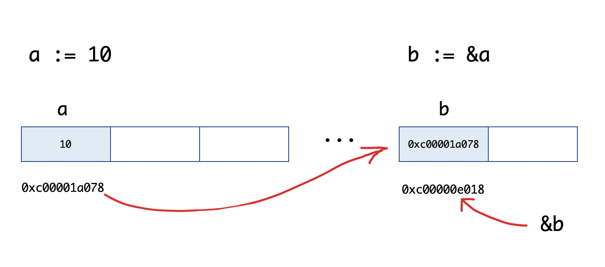
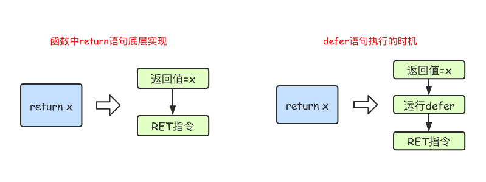

# 指针

https://www.liwenzhou.com/posts/Go/07_pointer/

[搞懂Go语言中的值、指针、引用类型](http://note.youdao.com/noteshare?id=115fb8d04f926b9989b497126b2f0cbd)


区别于C/C++中的指针，Go语言中的指针不能进行偏移和运算，是安全指针。

要搞明白Go语言中的指针需要先知道3个概念：指针地址、指针类型和指针取值。

任何程序数据载入内存后，在内存都有他们的地址，这就是指针。而为了保存一个数据在内存中的地址，我们就需要指针变量。

比如，“永远不要高估自己”这句话是我的座右铭，我想把它写入程序中，程序一启动这句话是要加载到内存（假设内存地址0x123456），我在程序中把这段话赋值给变量A，把内存地址赋值给变量B。这时候变量B就是一个指针变量。通过变量A和变量B都能找到我的座右铭。


Go语言中的指针不能进行偏移和运算，因此Go语言中的指针操作非常简单，我们只需要记住两个符号：&（取地址）和*（根据地址取值）。

## 指针地址和指针类型

每个变量在运行时都拥有一个地址，这个地址代表变量在内存中的位置。Go语言中使用&字符放在变量前面对变量进行“取地址”操作。 Go语言中的值类型（int、float、bool、string、array、struct）都有对应的指针类型，如：*int、*int64、*string等。

取变量指针的语法如下：
```
ptr := &v    // v的类型为T
```
其中：

- v:代表被取地址的变量，类型为T
- ptr:用于接收地址的变量，ptr的类型就为*T，称做T的指针类型。*代表指针。

举个例子：
```
func main() {
	a := 10
	b := &a
	fmt.Printf("a:%d ptr:%p\n", a, &a) // a:10 ptr:0xc00001a078
	fmt.Printf("b:%p type:%T\n", b, b) // b:0xc00001a078 type:*int
	fmt.Println(&b)                    // 0xc00000e018
}
```
我们来看一下b := &a的图示：


## 指针取值

在对普通变量使用&操作符取地址后会获得这个变量的指针，然后可以对指针使用*操作，也就是指针取值，代码如下：

```
func main() {
	//指针取值
	a := 10
	b := &a // 取变量a的地址，将指针保存到b中
	fmt.Printf("type of b:%T\n", b)
	c := *b // 指针取值（根据指针去内存取值）
	fmt.Printf("type of c:%T\n", c)
	fmt.Printf("value of c:%v\n", c)
}
```

```
type of b:*int
type of c:int
value of c:10
```

## 指针传值

```
func modify1(x int) {
	x = 100
}

func modify2(x *int) {
	*x = 100
}

func main() {
	a := 10
	modify1(a)
	fmt.Println(a) // 10
	modify2(&a)
	fmt.Println(a) // 100
}
```

## 指针总结
取地址操作符&和取值操作符*是一对互补操作符，&取出地址，*根据地址取出地址指向的值。

变量、指针地址、指针变量、取地址、取值的相互关系和特性如下：

- 对变量进行取地址（&）操作，可以获得这个变量的指针变量。
- 指针变量的值是指针地址。
- 对指针变量进行取值（*）操作，可以获得指针变量指向的原变量的值。


## new和make


我们先来看一个例子：

```
func main() {
	var a *int
	*a = 100
	fmt.Println(*a)

	var b map[string]int
	b["沙河娜扎"] = 100
	fmt.Println(b)
}
```
执行上面的代码会引发panic，为什么呢？

在Go语言中对于引用类型的变量，我们在使用的时候不仅要声明它，还要为它分配内存空间，否则我们的值就没办法存储。而对于值类型的声明不需要分配内存空间，是因为它们在声明的时候已经默认分配好了内存空间。要分配内存，就引出来今天的new和make。 Go语言中new和make是内建的两个函数，主要用来分配内存。

### new
new是一个内置的函数，它的函数签名如下：

```
func new(Type) *Type
```
其中，Type表示类型，new函数只接受一个参数，这个参数是一个类型*Type表示类型指针，new函数返回一个指向该类型内存地址的指针。

new函数不太常用，使用new函数得到的是一个类型的指针，并且该指针对应的值为该类型的零值。举个例子：

```
func main() {
	a := new(int)
	b := new(bool)
	fmt.Printf("%T\n", a) // *int
	fmt.Printf("%T\n", b) // *bool
	fmt.Println(*a)       // 0
	fmt.Println(*b)       // false
}	
```
本节开始的示例代码中var a *int只是声明了一个指针变量a但是没有初始化，指针作为引用类型需要初始化后才会拥有内存空间，才可以给它赋值。应该按照如下方式使用内置的new函数对a进行初始化之后就可以正常对其赋值了：
```
func main() {
	var a *int
	a = new(int)
	*a = 10
	fmt.Println(*a)  // 10
}
```
### make
make也是用于内存分配的，区别于new，它只用于slice、map以及chan的内存创建，而且它返回的类型就是这三个类型本身，而不是他们的指针类型，因为这三种类型就是引用类型，所以就没有必要返回他们的指针了。make函数的函数签名如下：
```
func make(t Type, size ...IntegerType) Type
```
make函数是无可替代的，我们在使用slice、map以及channel的时候，都需要使用make进行初始化，然后才可以对它们进行操作。这个我们在上一章中都有说明，关于channel我们会在后续的章节详细说明。

本节开始的示例中var b map[string]int只是声明变量b是一个map类型的变量，需要像下面的示例代码一样使用make函数进行初始化操作之后，才能对其进行键值对赋值：
```
func main() {
	var b map[string]int
	b = make(map[string]int, 10)
	b["沙河娜扎"] = 100
	fmt.Println(b)
}
```
### new与make的区别
- 二者都是用来做内存分配的。
- make只用于slice、map以及channel的初始化，返回的还是这三个引用类型本身；
- 而new用于类型的内存分配，并且内存对应的值为类型零值，返回的是指向类型的指针。


# 结构体

https://www.liwenzhou.com/posts/Go/10_struct/

Go语言中没有“类”的概念，也不支持“类”的继承等面向对象的概念。Go语言中通过结构体的内嵌再配合接口比面向对象具有更高的扩展性和灵活性。

## 类型别名和自定义类型
### 自定义类型
在Go语言中有一些基本的数据类型，如string、整型、浮点型、布尔等数据类型， Go语言中可以使用type关键字来定义自定义类型。

自定义类型是定义了一个全新的类型。我们可以基于内置的基本类型定义，也可以通过struct定义。例如：
```
//将MyInt定义为int类型
type MyInt int
```
通过Type关键字的定义，MyInt就是一种新的类型，它具有int的特性。

### 类型别名
类型别名是Go1.9版本添加的新功能。

类型别名规定：TypeAlias只是Type的别名，本质上TypeAlias与Type是同一个类型。就像一个孩子小时候有小名、乳名，上学后用学名，英语老师又会给他起英文名，但这些名字都指的是他本人。
```
type TypeAlias = Type
```
我们之前见过的rune和byte就是类型别名，他们的定义如下：
```
type byte = uint8
type rune = int32
```
### 类型定义和类型别名的区别
类型别名与类型定义表面上看只有一个等号的差异，我们通过下面的这段代码来理解它们之间的区别。
```
//类型定义
type NewInt int

//类型别名
type MyInt = int

func main() {
	var a NewInt
	var b MyInt
	
	fmt.Printf("type of a:%T\n", a) //type of a:main.NewInt
	fmt.Printf("type of b:%T\n", b) //type of b:int
}
```
结果显示a的类型是main.NewInt，表示main包下定义的NewInt类型。b的类型是int。MyInt类型只会在代码中存在，编译完成时并不会有MyInt类型。

## 结构体
Go语言中的基础数据类型可以表示一些事物的基本属性，但是当我们想表达一个事物的全部或部分属性时，这时候再用单一的基本数据类型明显就无法满足需求了，Go语言提供了一种自定义数据类型，可以封装多个基本数据类型，这种数据类型叫结构体，英文名称struct。 也就是我们可以通过struct来定义自己的类型了。

Go语言中通过struct来实现面向对象。

结构体的定义
使用type和struct关键字来定义结构体，具体代码格式如下：

```
type 类型名 struct {
    字段名 字段类型
    字段名 字段类型
    …
}
```
其中：

类型名：标识自定义结构体的名称，在同一个包内不能重复。
字段名：表示结构体字段名。结构体中的字段名必须唯一。
字段类型：表示结构体字段的具体类型。
举个例子，我们定义一个Person（人）结构体，代码如下：

```
type person struct {
	name string
	city string
	age  int8
}
```
同样类型的字段也可以写在一行，
```
type person1 struct {
	name, city string
	age        int8
}
```
这样我们就拥有了一个person的自定义类型，它有name、city、age三个字段，分别表示姓名、城市和年龄。这样我们使用这个person结构体就能够很方便的在程序中表示和存储人信息了。

语言内置的基础数据类型是用来描述一个值的，而结构体是用来描述一组值的。比如一个人有名字、年龄和居住城市等，本质上是一种聚合型的数据类型

### 结构体实例化
只有当结构体实例化时，才会真正地分配内存。也就是必须实例化后才能使用结构体的字段。

结构体本身也是一种类型，我们可以像声明内置类型一样使用var关键字声明结构体类型。

var 结构体实例 结构体类型
基本实例化
举个例子：
```
type person struct {
	name string
	city string
	age  int8
}

func main() {
	var p1 person
	p1.name = "沙河娜扎"
	p1.city = "北京"
	p1.age = 18
	fmt.Printf("p1=%v\n", p1)  //p1={沙河娜扎 北京 18}
	fmt.Printf("p1=%#v\n", p1) //p1=main.person{name:"沙河娜扎", city:"北京", age:18}
}
```
我们通过.来访问结构体的字段（成员变量）,例如p1.name和p1.age等。

### 匿名结构体
在定义一些临时数据结构等场景下还可以使用匿名结构体。

```
package main
     
import (
    "fmt"
)
     
func main() {
    var user struct{Name string; Age int}
    user.Name = "小王子"
    user.Age = 18
    fmt.Printf("%#v\n", user)
}
```
### 创建指针类型结构体
我们还可以通过使用new关键字对结构体进行实例化，得到的是结构体的地址。 格式如下：

```
var p2 = new(person)
fmt.Printf("%T\n", p2)     //*main.person
fmt.Printf("p2=%#v\n", p2) //p2=&main.person{name:"", city:"", age:0}
```
从打印的结果中我们可以看出p2是一个结构体指针。

需要注意的是在Go语言中支持对结构体指针直接使用.来访问结构体的成员。
```
var p2 = new(person)
p2.name = "小王子"
p2.age = 28
p2.city = "上海"
fmt.Printf("p2=%#v\n", p2) //p2=&main.person{name:"小王子", city:"上海", age:28}
```
### 取结构体的地址实例化
使用&对结构体进行取地址操作相当于对该结构体类型进行了一次new实例化操作。

```
p3 := &person{}
fmt.Printf("%T\n", p3)     //*main.person
fmt.Printf("p3=%#v\n", p3) //p3=&main.person{name:"", city:"", age:0}
p3.name = "七米"
p3.age = 30
p3.city = "成都"
fmt.Printf("p3=%#v\n", p3) //p3=&main.person{name:"七米", city:"成都", age:30}
p3.name = "七米"其实在底层是(*p3).name = "七米"，这是Go语言帮我们实现的语法糖。
```
### 结构体初始化
没有初始化的结构体，其成员变量都是对应其类型的零值。
```
type person struct {
	name string
	city string
	age  int8
}

func main() {
	var p4 person
	fmt.Printf("p4=%#v\n", p4) //p4=main.person{name:"", city:"", age:0}
}
```
### 使用键值对初始化
使用键值对对结构体进行初始化时，键对应结构体的字段，值对应该字段的初始值。
```
p5 := person{
	name: "小王子",
	city: "北京",
	age:  18,
}
fmt.Printf("p5=%#v\n", p5) //p5=main.person{name:"小王子", city:"北京", age:18}
```
也可以对结构体指针进行键值对初始化，例如：

```
p6 := &person{
	name: "小王子",
	city: "北京",
	age:  18,
}
fmt.Printf("p6=%#v\n", p6) //p6=&main.person{name:"小王子", city:"北京", age:18}
```
当某些字段没有初始值的时候，该字段可以不写。此时，没有指定初始值的字段的值就是该字段类型的零值。

```
p7 := &person{
	city: "北京",
}
fmt.Printf("p7=%#v\n", p7) //p7=&main.person{name:"", city:"北京", age:0}
```
### 使用值的列表初始化
初始化结构体的时候可以简写，也就是初始化的时候不写键，直接写值：

```
p8 := &person{
	"沙河娜扎",
	"北京",
	28,
}
fmt.Printf("p8=%#v\n", p8) //p8=&main.person{name:"沙河娜扎", city:"北京", age:28}
```
使用这种格式初始化时，需要注意：

- 必须初始化结构体的所有字段。
- 初始值的填充顺序必须与字段在结构体中的声明顺序一致。
- 该方式不能和键值初始化方式混用。

### 结构体内存布局
结构体占用一块连续的内存。
```
type test struct {
	a int8
	b int8
	c int8
	d int8
}
n := test{
	1, 2, 3, 4,
}
fmt.Printf("n.a %p\n", &n.a)
fmt.Printf("n.b %p\n", &n.b)
fmt.Printf("n.c %p\n", &n.c)
fmt.Printf("n.d %p\n", &n.d)
```
输出：
```
n.a 0xc0000a0060
n.b 0xc0000a0061
n.c 0xc0000a0062
n.d 0xc0000a0063
```

### 面试题
请问下面代码的执行结果是什么？

```
type student struct {
	name string
	age  int
}

func main() {
	m := make(map[string]*student)
	stus := []student{
		{name: "小王子", age: 18},
		{name: "娜扎", age: 23},
		{name: "大王八", age: 9000},
	}

	for _, stu := range stus {
		m[stu.name] = &stu
	}
	for k, v := range m {
		fmt.Println(k, "=>", v.name)
	}
}
```
### 构造函数
Go语言的结构体没有构造函数，我们可以自己实现。 例如，下方的代码就实现了一个person的构造函数。 因为struct是值类型，如果结构体比较复杂的话，值拷贝性能开销会比较大，所以该构造函数返回的是结构体指针类型。

```
func newPerson(name, city string, age int8) *person {
	return &person{
		name: name,
		city: city,
		age:  age,
	}
}
```
调用构造函数
```
p9 := newPerson("张三", "沙河", 90)
fmt.Printf("%#v\n", p9) //&main.person{name:"张三", city:"沙河", age:90}
```
### 方法和接收者
Go语言中的方法（Method）是一种作用于特定类型变量的函数。这种特定类型变量叫做接收者（Receiver）。接收者的概念就类似于其他语言中的this或者 self。

方法的定义格式如下：
```
func (接收者变量 接收者类型) 方法名(参数列表) (返回参数) {
    函数体
}
```
其中，

接收者变量：接收者中的参数变量名在命名时，官方建议使用接收者类型名的第一个小写字母，而不是self、this之类的命名。例如，Person类型的接收者变量应该命名为 p，Connector类型的接收者变量应该命名为c等。
接收者类型：接收者类型和参数类似，可以是指针类型和非指针类型。
方法名、参数列表、返回参数：具体格式与函数定义相同。
举个例子：

```
//Person 结构体
type Person struct {
	name string
	age  int8
}

//NewPerson 构造函数
func NewPerson(name string, age int8) *Person {
	return &Person{
		name: name,
		age:  age,
	}
}

//Dream Person做梦的方法
func (p Person) Dream() {
	fmt.Printf("%s的梦想是学好Go语言！\n", p.name)
}

func main() {
	p1 := NewPerson("小王子", 25)
	p1.Dream()
}
```
方法与函数的区别是，函数不属于任何类型，方法属于特定的类型。

### 指针类型的接收者
指针类型的接收者由一个结构体的指针组成，由于指针的特性，调用方法时修改接收者指针的任意成员变量，在方法结束后，修改都是有效的。这种方式就十分接近于其他语言中面向对象中的this或者self。 例如我们为Person添加一个SetAge方法，来修改实例变量的年龄。

```
// SetAge 设置p的年龄
// 使用指针接收者
func (p *Person) SetAge(newAge int8) {
	p.age = newAge
}
```
调用该方法：

```
func main() {
	p1 := NewPerson("小王子", 25)
	fmt.Println(p1.age) // 25
	p1.SetAge(30)
	fmt.Println(p1.age) // 30
}
```
### 值类型的接收者
当方法作用于值类型接收者时，Go语言会在代码运行时将接收者的值复制一份。在值类型接收者的方法中可以获取接收者的成员值，但修改操作只是针对副本，无法修改接收者变量本身。

```
// SetAge2 设置p的年龄
// 使用值接收者
func (p Person) SetAge2(newAge int8) {
	p.age = newAge
}

func main() {
	p1 := NewPerson("小王子", 25)
	p1.Dream()
	fmt.Println(p1.age) // 25
	p1.SetAge2(30) // (*p1).SetAge2(30)
	fmt.Println(p1.age) // 25
}
```
### 什么时候应该使用指针类型接收者
- 需要修改接收者中的值
- 接收者是拷贝代价比较大的大对象
- 保证一致性，如果有某个方法使用了指针接收者，那么其他的方法也应该使用指针接收者。

### 任意类型添加方法

在Go语言中，接收者的类型可以是任何类型，不仅仅是结构体，任何类型都可以拥有方法。 举个例子，我们基于内置的int类型使用type关键字可以定义新的自定义类型，然后为我们的自定义类型添加方法。

```
//MyInt 将int定义为自定义MyInt类型
type MyInt int

//SayHello 为MyInt添加一个SayHello的方法
func (m MyInt) SayHello() {
	fmt.Println("Hello, 我是一个int。")
}
func main() {
	var m1 MyInt
	m1.SayHello() //Hello, 我是一个int。
	m1 = 100
	fmt.Printf("%#v  %T\n", m1, m1) //100  main.MyInt
}
```
注意事项： 非本地类型不能定义方法，也就是说我们不能给别的包的类型定义方法。

### 结构体的匿名字段
结构体允许其成员字段在声明时没有字段名而只有类型，这种没有名字的字段就称为匿名字段。

```
//Person 结构体Person类型
type Person struct {
	string
	int
}

func main() {
	p1 := Person{
		"小王子",
		18,
	}
	fmt.Printf("%#v\n", p1)        //main.Person{string:"北京", int:18}
	fmt.Println(p1.string, p1.int) //北京 18
}
```
匿名字段默认采用类型名作为字段名，结构体要求字段名称必须唯一，因此一个结构体中同种类型的匿名字段只能有一个。

### 嵌套结构体
一个结构体中可以嵌套包含另一个结构体或结构体指针。

```
//Address 地址结构体
type Address struct {
	Province string
	City     string
}

//User 用户结构体
type User struct {
	Name    string
	Gender  string
	Address Address
}

func main() {
	user1 := User{
		Name:   "小王子",
		Gender: "男",
		Address: Address{
			Province: "山东",
			City:     "威海",
		},
	}
	fmt.Printf("user1=%#v\n", user1)//user1=main.User{Name:"小王子", Gender:"男", Address:main.Address{Province:"山东", City:"威海"}}
}
```
### 嵌套匿名结构体
```
//Address 地址结构体
type Address struct {
	Province string
	City     string
}

//User 用户结构体
type User struct {
	Name    string
	Gender  string
	Address //匿名结构体
}

func main() {
	var user2 User
	user2.Name = "小王子"
	user2.Gender = "男"
	user2.Address.Province = "山东"    //通过匿名结构体.字段名访问
	user2.City = "威海"                //直接访问匿名结构体的字段名
	fmt.Printf("user2=%#v\n", user2) //user2=main.User{Name:"小王子", Gender:"男", Address:main.Address{Province:"山东", City:"威海"}}
}
```
当访问结构体成员时会先在结构体中查找该字段，找不到再去匿名结构体中查找。

### 嵌套结构体的字段名冲突
嵌套结构体内部可能存在相同的字段名。这个时候为了避免歧义需要指定具体的内嵌结构体的字段。

```
//Address 地址结构体
type Address struct {
	Province   string
	City       string
	CreateTime string
}

//Email 邮箱结构体
type Email struct {
	Account    string
	CreateTime string
}

//User 用户结构体
type User struct {
	Name   string
	Gender string
	Address
	Email
}

func main() {
	var user3 User
	user3.Name = "沙河娜扎"
	user3.Gender = "男"
	// user3.CreateTime = "2019" //ambiguous selector user3.CreateTime
	user3.Address.CreateTime = "2000" //指定Address结构体中的CreateTime
	user3.Email.CreateTime = "2000"   //指定Email结构体中的CreateTime
}
```
### 结构体的“继承”
Go语言中使用结构体也可以实现其他编程语言中面向对象的继承。

```
//Animal 动物
type Animal struct {
	name string
}

func (a *Animal) move() {
	fmt.Printf("%s会动！\n", a.name)
}

//Dog 狗
type Dog struct {
	Feet    int8
	*Animal //通过嵌套匿名结构体实现继承
}

func (d *Dog) wang() {
	fmt.Printf("%s会汪汪汪~\n", d.name)
}

func main() {
	d1 := &Dog{
		Feet: 4,
		Animal: &Animal{ //注意嵌套的是结构体指针
			name: "乐乐",
		},
	}
	d1.wang() //乐乐会汪汪汪~
	d1.move() //乐乐会动！
}
```
### 结构体字段的可见性
结构体中字段大写开头表示可公开访问，小写表示私有（仅在定义当前结构体的包中可访问）。

### 结构体与JSON序列化
JSON(JavaScript Object Notation) 是一种轻量级的数据交换格式。易于人阅读和编写。同时也易于机器解析和生成。JSON键值对是用来保存JS对象的一种方式，键/值对组合中的键名写在前面并用双引号""包裹，使用冒号:分隔，然后紧接着值；多个键值之间使用英文,分隔。

```
//Student 学生
type Student struct {
	ID     int
	Gender string
	Name   string
}

//Class 班级
type Class struct {
	Title    string
	Students []*Student
}

func main() {
	c := &Class{
		Title:    "101",
		Students: make([]*Student, 0, 200),
	}
	for i := 0; i < 10; i++ {
		stu := &Student{
			Name:   fmt.Sprintf("stu%02d", i),
			Gender: "男",
			ID:     i,
		}
		c.Students = append(c.Students, stu)
	}
	//JSON序列化：结构体-->JSON格式的字符串
	data, err := json.Marshal(c)
	if err != nil {
		fmt.Println("json marshal failed")
		return
	}
	fmt.Printf("json:%s\n", data)
	//JSON反序列化：JSON格式的字符串-->结构体
	str := `{"Title":"101","Students":[{"ID":0,"Gender":"男","Name":"stu00"},{"ID":1,"Gender":"男","Name":"stu01"},{"ID":2,"Gender":"男","Name":"stu02"},{"ID":3,"Gender":"男","Name":"stu03"},{"ID":4,"Gender":"男","Name":"stu04"},{"ID":5,"Gender":"男","Name":"stu05"},{"ID":6,"Gender":"男","Name":"stu06"},{"ID":7,"Gender":"男","Name":"stu07"},{"ID":8,"Gender":"男","Name":"stu08"},{"ID":9,"Gender":"男","Name":"stu09"}]}`
	c1 := &Class{}
	err = json.Unmarshal([]byte(str), c1)
	if err != nil {
		fmt.Println("json unmarshal failed!")
		return
	}
	fmt.Printf("%#v\n", c1)
}
```
### 结构体标签（Tag）
Tag是结构体的元信息，可以在运行的时候通过反射的机制读取出来。 Tag在结构体字段的后方定义，由一对反引号包裹起来，具体的格式如下：
```
`key1:"value1" key2:"value2"`
```
结构体标签由一个或多个键值对组成。键与值使用冒号分隔，值用双引号括起来。键值对之间使用一个空格分隔。 注意事项： 为结构体编写Tag时，必须严格遵守键值对的规则。结构体标签的解析代码的容错能力很差，一旦格式写错，编译和运行时都不会提示任何错误，通过反射也无法正确取值。例如不要在key和value之间添加空格。

例如我们为Student结构体的每个字段定义json序列化时使用的Tag：
```
//Student 学生
type Student struct {
	ID     int    `json:"id"` //通过指定tag实现json序列化该字段时的key
	Gender string //json序列化是默认使用字段名作为key
	name   string //私有不能被json包访问
}

func main() {
	s1 := Student{
		ID:     1,
		Gender: "男",
		name:   "沙河娜扎",
	}
	data, err := json.Marshal(s1)
	if err != nil {
		fmt.Println("json marshal failed!")
		return
	}
	fmt.Printf("json str:%s\n", data) //json str:{"id":1,"Gender":"男"}
}
```

# defer



# time
https://www.liwenzhou.com/posts/Go/go_time/

```
package main

import (
	"fmt"
	"time"
)
/* 时间间隔
const (
	Nanosecond  Duration = 1
	Microsecond          = 1000 * Nanosecond
	Millisecond          = 1000 * Microsecond
	Second               = 1000 * Millisecond
	Minute               = 60 * Second
	Hour                 = 60 * Minute
)
*/

// 时间类型
func timeDemo(){
	now := time.Now()  // 获取当前时间
	fmt.Printf("Current time: %v\n", now)
	year := now.Year()
	month := now.Month()
	day := now.Day()
	hour := now.Hour()
	minute := now.Minute()
	second := now.Second()
	fmt.Printf("%d-%02d-%02d %02d:%02d:%02d\n", year, month, day, hour, minute, second)
}

// 当前时间戳
func timestampDemo() {
	now := time.Now()  // 获取当前时间
	timestamp1 := now.Unix()
	timestamp2 := now.UnixNano()
	fmt.Printf("current timestamp1:%v\n", timestamp1)
	fmt.Printf("current timestamp2:%v\n", timestamp2)
}

// 时间戳转换
func timestampDemo2(timestamp int64) {
	timeObj := time.Unix(timestamp, 0) //将时间戳转为时间格式
	fmt.Println(timeObj)
	year := timeObj.Year()     //年
	month := timeObj.Month()   //月
	day := timeObj.Day()       //日
	hour := timeObj.Hour()     //小时
	minute := timeObj.Minute() //分钟
	second := timeObj.Second() //秒
	fmt.Printf("%d-%02d-%02d %02d:%02d:%02d\n", year, month, day, hour, minute, second)
}

// 时间操作
func timeOP(){
	now := time.Now()
	// Add
	later := now.Add(time.Hour)
	fmt.Printf("Later time: %v\n", later)
	// Sub
	duration := later.Sub(later)
	fmt.Printf("Duration: %v\n",duration)
	// Equal
	isEqual := now.Equal(later)
	fmt.Printf("now is equal later: %v\n",isEqual)
	// Before
	isBefore := now.Before(later)
	fmt.Printf("now is before later: %v\n",isBefore)
	// After
	isAfter := now.After(later)
	fmt.Printf("now is after later: %v\n",isAfter)
}

// 定时器
func tickDemo()  {
	ticker := time.Tick(time.Second)
	for i := range ticker {
		fmt.Println(i)
	}
}

// 时间格式化
func formatDemo() {
	now := time.Now()
	// 格式化的模板为Go的出生时间2006年1月2号15点04分 Mon Jan
	// 24小时制
	fmt.Println(now.Format("2006-01-02 15:04:05.000 Mon Jan"))
	// 12小时制
	fmt.Println(now.Format("2006-01-02 03:04:05.000 PM Mon Jan"))
	fmt.Println(now.Format("2006/01/02 15:04"))
	fmt.Println(now.Format("15:04 2006/01/02"))
	fmt.Println(now.Format("2006/01/02"))
}

func formatFromString(){
	now := time.Now()
	fmt.Println(now)
	// 加载时区
	loc, err := time.LoadLocation("Asia/Shanghai")
	if err != nil {
		fmt.Println(err)
		return
	}
	// 按照指定时区和指定格式解析字符串时间
	timeObj, err := time.ParseInLocation("2006/01/02 15:04:05", "2019/08/04 14:15:20", loc)
	if err != nil {
		fmt.Println(err)
		return
	}
	fmt.Println(timeObj)
}


func main(){
	timeDemo()
	timestampDemo()
	timestampDemo2(time.Now().Unix())
	timeOP()
	//tickDemo()
	formatDemo()
	formatFromString()
}
```
# 接口
https://www.liwenzhou.com/posts/Go/12_interface/
```
package main

import "fmt"

/*
// 接口定义
type 接口类型名 interface{
    方法名1( 参数列表1 ) 返回值列表1
    方法名2( 参数列表2 ) 返回值列表2
    …
}
*/

// Sayer 接口
type Sayer interface {
	say()
}

/*
  一个对象只要全部实现了接口中的方法，那么就实现了这个接口
  换句话说，接口就是一个需要实现的方法列表
*/

// dog 对象
type dog struct {}

// cat 对象
type cat struct {}

// dog实现了Sayer接口
func (d dog) say() {
	fmt.Println("汪汪汪")
}

// cat实现了Sayer接口
func (c cat) say() {
	fmt.Println("喵喵喵")
}

// 接口类型变量
func interfaceDemo1() {
	var sayer Sayer // 声明一个Sayer类型的变量sayer
	var mover Mover
	cat1 := cat{}   // 实例化一个cat
	dog1 := dog{}   // 实例化一个dog
	sayer = cat1    // 可以把cat实例直接赋值给sayer
	sayer.say()     // 喵喵喵
	sayer = dog1    // 可以把dog实例直接赋值给sayer
	sayer.say()     // 汪汪汪
	mover = dog1
	mover.move()
}

// 接口嵌套
type animal interface {
	Sayer
	Mover
}

// 值接收者和指针接收者实现接口的区别
type Mover interface {
	move()
}

/*
使用值接收者实现接口之后，不管是dog结构体还是结构体指针*dog类型的变量都可以赋值给该接口变量
使用指针接收者实现接口之后，只能接收结构体指针*dog类型的变量
*/

func (d dog) move() {  // 值接收者实现接口
//func (d *dog) move() {  // 指针接收者实现接口
	fmt.Println("狗会动")
}

func (c cat) move() {
	fmt.Println("猫会动")
}

// 空接口
/*
 空接口是指没有定义任何方法的接口。因此任何类型都实现了空接口。
 空接口类型的变量可以存储任意类型的变量。
*/

func interfaceDemo2(){
	// 定义一个空接口x
	var x interface{}
	s := "Hello 沙河"
	x = s
	fmt.Printf("type:%T value:%v\n", x, x)
	i := 100
	x = i
	fmt.Printf("type:%T value:%v\n", x, x)
	b := true
	x = b
	fmt.Printf("type:%T value:%v\n", x, x)
}

/*
空接口的应用
// 空接口作为函数的参数
func show(a interface{}) {
	fmt.Printf("type:%T value:%v\n", a, a)
}
// 空接口作为map的值
var studentInfo = make(map[string]interface{})
studentInfo["name"] = "沙河娜扎"
studentInfo["age"] = 18
studentInfo["married"] = false
fmt.Println(studentInfo)
 */

func main() {
	interfaceDemo1()
	interfaceDemo2()
}
```


```
// 类型断言
var w io.Writer
w = os.Stdout
w = new(bytes.Buffer)
w = nil
```


```
// 想要判断空接口中的值这个时候就可以使用类型断言，其语法格式：
// x.(T)

func main() {
	var x interface{}
	x = "Hello 沙河"
	v, ok := x.(string)
	if ok {
		fmt.Println(v)
	} else {
		fmt.Println("类型断言失败")
	}
}

func justifyType(x interface{}) {
	switch v := x.(type) {
	case string:
		fmt.Printf("x is a string，value is %v\n", v)
	case int:
		fmt.Printf("x is a int is %v\n", v)
	case bool:
		fmt.Printf("x is a bool is %v\n", v)
	default:
		fmt.Println("unsupport type！")
	}
}
```

关于接口需要注意的是，只有当有两个或两个以上的具体类型必须以相同的方式进行处理时才需要定义接口。不要为了接口而写接口，那样只会增加不必要的抽象，导致不必要的运行时损耗


# 文件操作
https://www.liwenzhou.com/posts/Go/go_file/

## 打开和关闭文件

```
package main

/*
打开和关闭文件
 */

import (
	"fmt"
	"os"
)

// os.Open()函数能够打开一个文件，返回一个*File和一个err。对得到的文件实例调用close()方法能够关闭文件

func main() {
	// 只读方式打开当前目录下的main.go文件
	file, err := os.Open("./test.txt")

	if err != nil {
		fmt.Println("Open file failed, err:", err)
		return
	}

	// 关闭文件
	defer file.Close()
}
```

## 读取文件

```
package main

/*
  读取文件  func (f *File) Read(b []byte) (n int, err error)
 */

import (
	"fmt"
	"io"
	"os"
)


// 循环读取
func readAll(file *os.File) (content []byte) {

	var tmp = make([]byte, 128)
	for{
		n, err := file.Read(tmp)  // 它接收一个字节切片，返回读取的字节数和可能的具体错误，读到文件末尾时会返回0和io.EOF
		if err == io.EOF {
			return
		}
		if err != nil {
			fmt.Println("read file failed, err:", err)
			return
		}
		content = append(content, tmp[:n]...)
	}
	return
}


func main(){
	file, err := os.Open("./test.txt")

	if err != nil {
		fmt.Println("Open file failed, err:", err)
		return
	}

	defer file.Close()

	//// 使用Read方法读取数据
	//var tmp = make([]byte, 128)
	//n, err := file.Read(tmp)  // 它接收一个字节切片，返回读取的字节数和可能的具体错误，读到文件末尾时会返回0和io.EOF
	//if err == io.EOF {
	//	fmt.Println("文件读完了")
	//	return
	//}
	//if err != nil {
	//	fmt.Println("read file failed, err:", err)
	//	return
	//}
	//fmt.Printf("读取了%d字节数据\n", n)
	//fmt.Println(string(tmp[:n]))

	// 循环读取
	content := readAll(file)
	fmt.Println(string(content[:]))
}

```
### bufio读取文件

```
package main

import (
	"bufio"
	"fmt"
	"io"
	"os"
)

/*
  bufio读取文件
  bufio是在File的基础上封装了一层API，支持更多的功能
 */

func main(){
	file, err := os.Open("./test.txt")

	if err != nil {
		fmt.Println("Open file failed, err:", err)
		return
	}

	defer file.Close()

	reader := bufio.NewReader(file)
	for {
		line, err := reader.ReadString('\n')  // 注意是字符
		if err == io.EOF {
			if len(line) != 0{
				fmt.Print(line)
			}
			fmt.Println("文件读完了")
			break
		}
		if err != nil {
			fmt.Println("read file failed, err:", err)
			return
		}
		fmt.Print(line)
	}
}
```
## ioutil 读取整个文件
```
package main

import (
	"fmt"
	"io/ioutil"
)

/*
ioutil 读取整个文件
 */

func main() {
	content, err := ioutil.ReadFile("./test.txt")
	if err != nil {
		fmt.Println("read file failed, err:", err)
		return
	}
	fmt.Println(string(content))
}
```
## 文件写入
```
package main

import (
	"fmt"
	"io/ioutil"
	"os"
)

/*
文件写入操作
os.OpenFile() 函数能够以指定模式打开文件，从而实现文件写入相关功能

func OpenFile(name string, flag int, perm FileMode) (*File, error)
name: 要打开的文件名
flag: 打开文件的模式，模式有以下几种
os.O_WRONLY	只写
os.O_CREATE	创建文件
os.O_RDONLY	只读
os.O_RDWR	读写
os.O_TRUNC	清空
os.O_APPEND	追加
perm: 文件权限
*/


func main(){
	file, err := os.OpenFile("./write.txt", os.O_CREATE|os.O_WRONLY, 0644)
	if err != nil {
		fmt.Println("open file failed, err:", err)
		return
	}
	defer file.Close()

	// Write 和 WriteString
	str := "Hello 世界"
	file.Write([]byte(str))  // 写入字节切片数据
	file.WriteString(str)  // 直接写入字符串数据

	// ioutil.WriteFile
	err = ioutil.WriteFile("./ioutil.txt", []byte(str), 0644)
	if err != nil{
		fmt.Println("write file failed, err:", err)
		return
	}
}

```

## io.Copy 拷贝文件

```
package main

import (
	"fmt"
	"io"
	"os"
)

/*
使用 io.Copy实现一个拷贝文件函数
 */

func CopyFile(dstName, srcName string)(written int64, err error){
	// 以读方式打开源文件
	src, err := os.Open(srcName)
	if err != nil {
		fmt.Printf("open %s failed, err: %v\n", srcName, err)
		return
	}
	defer src.Close()
	// 以写|创建的方式打开目标文件
	dst, err := os.OpenFile(dstName, os.O_CREATE|os.O_WRONLY, 0644)
	if err != nil {
		fmt.Println("open %s failed, err: %v\n", dstName, err)
	}
	defer dst.Close()

	return io.Copy(dst, src)  // 调用io.Copy拷贝内容
}

func main() {
	_, err := CopyFile("copy.txt", "test.txt")
	if err != nil {
		fmt.Println("copy file failed, err:", err)
		return
	}
	fmt.Println("copy done!")
}

```

## 实现cat命令功能

```
package main

import (
	"bufio"
	"flag"
	"fmt"
	"io"
	"os"
)

/*
实现cat命令功能
 */

func cat(r *bufio.Reader) {
	for {
		buf, err := r.ReadBytes('\n')  // 注意是字符
		if err == io.EOF {
			break
		}
		fmt.Fprintf(os.Stdout, "%s", buf)
	}
}


func main() {
	flag.Parse()  // 解析命令行参数
	if flag.NArg() == 0 {
		// 如果没有参数默认从标准输入读取内容
		cat(bufio.NewReader(os.Stdin))
	}
	// 依次读取每个指定文件的内容并打印到终端
	for i := 0; i < flag.NArg(); i++ {
		f, err := os.Open(flag.Arg(i))
		if err != nil {
			fmt.Fprintf(os.Stdout, "reading from %s failed, err:%v\n", flag.Arg(i), err)
			continue
		}
		cat(bufio.NewReader(f))
	}
}
```
# 包

https://www.liwenzhou.com/posts/Go/11_package/

```golang
/*
在工程化的Go语言开发项目中，Go语言的源码复用是建立在包（package）基础之上的。本文介绍了Go语言中如何定义包、如何导出包的内容及如何导入其他包。

包（package）是多个Go源码的集合，是一种高级的代码复用方案，Go语言为我们提供了很多内置包，如fmt、os、io等。

我们还可以根据自己的需要创建自己的包。一个包可以简单理解为一个存放.go文件的文件夹。 该文件夹下面的所有go文件都要在代码的第一行添加如下代码，声明该文件归属的包。
package 包名
注意事项：
一个文件夹下面直接包含的文件只能归属一个package，同样一个package的文件不能在多个文件夹下。
包名可以不和文件夹的名字一样，包名不能包含 - 符号。
包名为main的包为应用程序的入口包，这种包编译后会得到一个可执行文件，而编译不包含main包的源代码则不会得到可执行文件。
*/
/*
如果想在一个包中引用另外一个包里的标识符（如变量、常量、类型、函数等）时，该标识符必须是对外可见的（public）。在Go语言中只需要将标识符的首字母大写就可以让标识符对外可见了。

举个例子， 我们定义一个包名为pkg2的包，代码如下：
*/
/*
package pkg2

import "fmt"

// 包变量可见性

var a = 100 // 首字母小写，外部包不可见，只能在当前包内使用

// 首字母大写外部包可见，可在其他包中使用
const Mode = 1

type person struct { // 首字母小写，外部包不可见，只能在当前包内使用
	name string
}

// 首字母大写，外部包可见，可在其他包中使用
func Add(x, y int) int {
	return x + y
}

func age() { // 首字母小写，外部包不可见，只能在当前包内使用
	var Age = 18 // 函数局部变量，外部包不可见，只能在当前函数内使用
	fmt.Println(Age)
}
*/

/*
结构体中的字段名和接口中的方法名如果首字母都是大写，外部包可以访问这些字段和方法。例如：
*/

/*
type Student struct {
	Name  string //可在包外访问的方法
	class string //仅限包内访问的字段
}

type Payer interface {
	init() //仅限包内访问的方法
	Pay()  //可在包外访问的方法
}
*/

/*
包的导入
import "包的路径"
注意事项：
import导入语句通常放在文件开头包声明语句的下面。
导入的包名需要使用双引号包裹起来。
包名是从$GOPATH/src/后开始计算的，使用/进行路径分隔。
Go语言中禁止循环导入包。
*/

/*
单行导入
单行导入的格式如下：
import "包1"
import "包2"

多行导入
多行导入的格式如下：
import (
    "包1"
    "包2"
)
*/

/*
自定义包名
在导入包名的时候，我们还可以为导入的包设置别名。通常用于导入的包名太长或者导入的包名冲突的情况。具体语法格式如下：

import 别名 "包的路径"

单行导入方式定义别名：
import "fmt"
import m "github.com/Q1mi/studygo/pkg_test"

func main() {
	fmt.Println(m.Add(100, 200))
	fmt.Println(m.Mode)
}

多行导入方式定义别名：
import (
    "fmt"
    m "github.com/Q1mi/studygo/pkg_test"
 )

func main() {
	fmt.Println(m.Add(100, 200))
	fmt.Println(m.Mode)
}
*/

/*
匿名导入包

如果只希望导入包，而不使用包内部的数据时，可以使用匿名导入包。具体的格式如下：

import _ "包的路径"

匿名导入的包与其他方式导入的包一样都会被编译到可执行文件中。
*/
```
```
/*
init()函数介绍
在Go语言程序执行时导入包语句会自动触发包内部init()函数的调用。需要注意的是： init()函数没有参数也没有返回值。 init()函数在程序运行时自动被调用执行，不能在代码中主动调用它。

包初始化执行的顺序如下图所示：
*/
```


```golang
/*
init()函数执行顺序
Go语言包会从main包开始检查其导入的所有包，每个包中又可能导入了其他的包。Go编译器由此构建出一个树状的包引用关系，再根据引用顺序决定编译顺序，依次编译这些包的代码。

在运行时，被最后导入的包会最先初始化并调用其init()函数， 如下图示：
 */
```


[TOC]

https://www.liwenzhou.com/posts/Go/14_concurrence/

# 并发与并行

并发：同一时间段内执行多个任务

并行：同一时刻执行多个任务

Go语言的并发通过`goroutine`实现。goroutine类似于线程，属于`用户态的线`程，我们可以根据需要创建成千上万个goroutine并发工作。goroutine是由Go语言的运行时（runtime）调度完成，而线程是由操作系统调度完成。

Go语言还提供channel在多个goroutine间进行通信。goroutine和channel是 Go 语言秉承的 `CSP`（Communicating Sequential Process）并发模式的重要实现基础。

# goroutine
在java/c++中我们要实现并发编程的时候，我们通常需要自己维护一个线程池，并且需要自己去包装一个又一个的任务，同时需要自己去调度线程执行任务并维护上下文切换。

Go语言中的goroutine就是这样一种机制，goroutine的概念类似于线程，但 goroutine是由`Go的运行时`（runtime）调度和管理的。Go程序会智能地将 goroutine 中的任务合理地分配给每个CPU。Go语言之所以被称为现代化的编程语言，就是因为它在语言层面已经内置了调度和上下文切换的机制。

在Go语言编程中你不需要去自己写`进程`、`线程`、`协程`，你的技能包里只有一个技能 `goroutine`，当你需要让某个任务并发执行的时候，你只需要把这个任务包装成一个函数，开启一个goroutine去执行这个函数就可以了，就是这么简单粗暴。

## goroutine使用
Go语言中使用goroutine非常简单，只需要在调用函数的时候在前面加上go关键字，就可以为一个函数创建一个goroutine。

一个goroutine必定对应一个函数，可以创建多个goroutine去执行相同的函数。

## 启动单个goroutine

```
func hello() {
	fmt.Println("Hello Goroutine!")
}
func main() {
	go hello()
	fmt.Println("main goroutine done!")
	time.Sleep(time.Second)
}
```
## 启动多个goroutine
在Go语言中实现并发就是这样简单，我们还可以启动多个goroutine。让我们再来一个例子： （这里使用了`sync.WaitGroup`来实现goroutine的同步）

```
var wg sync.WaitGroup

func hello(i int) {
	defer wg.Done() // goroutine结束就登记-1
	fmt.Println("Hello Goroutine!", i)
}
func main() {

	for i := 0; i < 10; i++ {
		wg.Add(1) // 启动一个goroutine就登记+1
		go hello(i)
	}
	wg.Wait() // 等待所有登记的goroutine都结束
}
```

多次执行上面的代码，会发现每次打印的数字的顺序都不一致。这是因为10个goroutine是并发执行的，而goroutine的调度是随机的。


## goroutine与线程

OS线程（操作系统线程）一般都有固定的栈内存（通常为2MB）,一个goroutine的栈在其生命周期开始时只有很小的栈（典型情况下2KB），goroutine的栈不是固定的，他可以按需增大和缩小，goroutine的栈大小限制可以达到1GB，虽然极少会用到这个大。所以在Go语言中一次创建十万左右的goroutine也是可以的。

## goroutine调度

GPM是Go语言运行时（runtime）层面的实现，是go语言自己实现的一套调度系统。区别于操作系统调度OS线程。

G很好理解，就是个goroutine的，里面除了存放本goroutine信息外 还有与所在P的绑定等信息。
P管理着一组goroutine队列，P里面会存储当前goroutine运行的上下文环境（函数指针，堆栈地址及地址边界），P会对自己管理的goroutine队列做一些调度（比如把占用CPU时间较长的goroutine暂停、运行后续的goroutine等等）当自己的队列消费完了就去全局队列里取，如果全局队列里也消费完了会去其他P的队列里抢任务。
M（machine）是Go运行时（runtime）对操作系统内核线程的虚拟， M与内核线程一般是一一映射的关系， 一个groutine最终是要放到M上执行的；
P与M一般也是一一对应的。他们关系是： P管理着一组G挂载在M上运行。当一个G长久阻塞在一个M上时，runtime会新建一个M，阻塞G所在的P会把其他的G 挂载在新建的M上。当旧的G阻塞完成或者认为其已经死掉时 回收旧的M。

P的个数是通过runtime.GOMAXPROCS设定（最大256），Go1.5版本之后默认为物理线程数。 在并发量大的时候会增加一些P和M，但不会太多，切换太频繁的话得不偿失。

单从线程调度讲，Go语言相比起其他语言的优势在于OS线程是由OS内核来调度的，goroutine则是由Go运行时（runtime）自己的调度器调度的，这个调度器使用一个称为m:n调度的技术（复用/调度m个goroutine到n个OS线程）。 其一大特点是goroutine的调度是在用户态下完成的， 不涉及内核态与用户态之间的频繁切换，包括内存的分配与释放，都是在用户态维护着一块大的内存池， 不直接调用系统的malloc函数（除非内存池需要改变），成本比调度OS线程低很多。 另一方面充分利用了多核的硬件资源，近似的把若干goroutine均分在物理线程上， 再加上本身goroutine的超轻量，以上种种保证了go调度方面的性能。


## GOMAXPROCS

Go运行时的调度器使用GOMAXPROCS参数来确定需要使用多少个OS线程来同时执行Go代码。默认值是机器上的CPU核心数。例如在一个8核心的机器上，调度器会把Go代码同时调度到8个OS线程上（GOMAXPROCS是m:n调度中的n）。

Go语言中可以通过runtime.GOMAXPROCS()函数设置当前程序并发时占用的CPU逻辑核心数。

Go1.5版本之前，默认使用的是单核心执行。Go1.5版本之后，默认使用全部的CPU逻辑核心数。

我们可以通过将任务分配到不同的CPU逻辑核心上实现并行的效果，这里举个例子：

```
func a() {
	for i := 1; i < 10; i++ {
		fmt.Println("A:", i)
	}
}

func b() {
	for i := 1; i < 10; i++ {
		fmt.Println("B:", i)
	}
}

func main() {
	runtime.GOMAXPROCS(1)
	go a()
	go b()
	time.Sleep(time.Second)
}
```

两个任务只有一个逻辑核心，此时是做完一个任务再做另一个任务。 将逻辑核心数设为2，此时两个任务并行执行，代码如下。

```
func a() {
	for i := 1; i < 10; i++ {
		fmt.Println("A:", i)
	}
}

func b() {
	for i := 1; i < 10; i++ {
		fmt.Println("B:", i)
	}
}

func main() {
	runtime.GOMAXPROCS(2)
	go a()
	go b()
	time.Sleep(time.Second)
}
```

Go语言中的操作系统线程和goroutine的关系：

- 一个操作系统线程对应用户态多个goroutine。
- go程序可以同时使用多个操作系统线程。
- goroutine和OS线程是多对多的关系，即m:n。

## worker pool（goroutine池）

在工作中我们通常会使用可以指定启动的goroutine数量–worker pool模式，控制goroutine的数量，防止goroutine泄漏和暴涨。

一个简易的work pool示例代码如下：

```
func worker(id int, jobs <-chan int, results chan<- int) {
	for j := range jobs {
		fmt.Printf("worker:%d start job:%d\n", id, j)
		time.Sleep(time.Second)
		fmt.Printf("worker:%d end job:%d\n", id, j)
		results <- j * 2
	}
}


func main() {
	jobs := make(chan int, 100)
	results := make(chan int, 100)
	// 开启3个goroutine
	for w := 1; w <= 3; w++ {
		go worker(w, jobs, results)
	}
	// 5个任务
	for j := 1; j <= 5; j++ {
		jobs <- j
	}
	close(jobs)
	// 输出结果
	for a := 1; a <= 5; a++ {
		<-results
	}
}
```
# channel

单纯地将函数并发执行是没有意义的。函数与函数间需要交换数据才能体现并发执行函数的意义。

虽然可以使用共享内存进行数据交换，但是共享内存在不同的goroutine中容易发生竞态问题。为了保证数据交换的正确性，必须使用互斥量对内存进行加锁，这种做法势必造成性能问题。

Go语言的并发模型是CSP（Communicating Sequential Processes），提倡通过通信共享内存而不是通过共享内存而实现通信。

如果说goroutine是Go程序并发的执行体，channel就是它们之间的连接。channel是可以让一个goroutine发送特定值到另一个goroutine的通信机制。

Go 语言中的通道（channel）是一种特殊的类型。通道像一个传送带或者队列，总是遵循先入先出（First In First Out）的规则，保证收发数据的顺序。每一个通道都是一个具体类型的导管，也就是声明channel的时候需要为其指定元素类型。

## channel 类型

channel是一种类型，一种引用类型。声明通道类型的格式如下：

```
var 变量 chan 元素类型

var ch1 chan int   // 声明一个传递整型的通道
var ch2 chan bool  // 声明一个传递布尔型的通道
var ch3 chan []int // 声明一个传递int切片的通道
```

声明的通道后需要使用make函数初始化之后才能使用。

创建channel的格式如下：

```
make(chan 元素类型, [缓冲大小])

ch4 := make(chan int)
ch5 := make(chan bool)
ch6 := make(chan []int)
```
channel的缓冲大小是可选的。

## channel操作

通道有发送（send）、接收(receive）和关闭（close）三种操作。

发送和接收都使用`<-`符号。

现在我们先使用以下语句定义一个通道：

```
ch := make(chan int)
```

将一个值发送到通道中


```
ch <- 10 // 把10发送到ch中
```

从一个通道中接收值

```
x := <- ch // 从ch中接收值并赋值给变量x
<-ch       // 从ch中接收值，忽略结果
```

我们通过调用内置的close函数来关闭通道

```
close(ch)
```

关于关闭通道需要注意的事情是，只有在通知接收方goroutine所有的数据都发送完毕的时候才需要关闭通道。通道是可以被垃圾回收机制回收的，它和关闭文件是不一样的，在结束操作之后关闭文件是必须要做的，但关闭通道不是必须的。

关闭后的通道有以下特点：

- 对一个关闭的通道再发送值就会导致panic。
- 对一个关闭的通道进行接收会一直获取值直到通道为空。
- 对一个关闭的并且没有值的通道执行接收操作会得到对应类型的零值。
- 关闭一个已经关闭的通道会导致panic。

## 无缓冲的通道


无缓冲的通道又称为阻塞的通道。我们来看一下下面的代码：

```
func main() {
	ch := make(chan int)
	ch <- 10
	fmt.Println("发送成功")
}
```

上面这段代码能够通过编译，但是执行的时候会出现以下错误：

```
fatal error: all goroutines are asleep - deadlock!

goroutine 1 [chan send]:
main.main()
        .../src/github.com/Q1mi/studygo/day06/channel02/main.go:8 +0x54
```
为什么会出现deadlock错误呢？

因为我们使用ch := make(chan int)创建的是无缓冲的通道，无缓冲的通道只有在有人接收值的时候才能发送值。就像你住的小区没有快递柜和代收点，快递员给你打电话必须要把这个物品送到你的手中，简单来说就是无缓冲的通道必须有接收才能发送。

上面的代码会阻塞在 `ch <- 10`这一行代码形成死锁，那如何解决这个问题呢？

一种方法是启用一个 `goroutine` 去接收值，例如：

```
func recv(c chan int) {
	ret := <-c
	fmt.Println("接收成功", ret)
}
func main() {
	ch := make(chan int)
	go recv(ch) // 启用goroutine从通道接收值
	ch <- 10
	fmt.Println("发送成功")
}
```
无缓冲通道上的发送操作会阻塞，直到另一个goroutine在该通道上执行接收操作，这时值才能发送成功，两个goroutine将继续执行。相反，如果接收操作先执行，接收方的goroutine将阻塞，直到另一个goroutine在该通道上发送一个值。

使用无缓冲通道进行通信将导致发送和接收的goroutine同步化。因此，无缓冲通道也被称为同步通道。

## 有缓冲的通道

解决上面问题的方法还有一种就是使用有缓冲区的通道。我们可以在使用make函数初始化通道的时候为其指定通道的容量，例如：

```
func main() {
	ch := make(chan int, 1) // 创建一个容量为1的有缓冲区通道
	ch <- 10
	fmt.Println("发送成功")
}
```
只要通道的容量大于零，那么该通道就是有缓冲的通道，通道的容量表示通道中能存放元素的数量。就像你小区的快递柜只有那么个多格子，格子满了就装不下了，就阻塞了，等到别人取走一个快递员就能往里面放一个。

我们可以使用内置的len函数获取通道内元素的数量，使用cap函数获取通道的容量，虽然我们很少会这么做。

## for range从通道循环取值

当向通道中发送完数据时，我们可以通过close函数来关闭通道。

当通道被关闭时，再往该通道发送值会引发panic，从该通道取值的操作会先取完通道中的值，再然后取到的值一直都是对应类型的零值。那如何判断一个通道是否被关闭了呢？

我们来看下面这个例子：

```
// channel 练习
func main() {
	ch1 := make(chan int)
	ch2 := make(chan int)
	// 开启goroutine将0~100的数发送到ch1中
	go func() {
		for i := 0; i < 100; i++ {
			ch1 <- i
		}
		close(ch1)
	}()
	// 开启goroutine从ch1中接收值，并将该值的平方发送到ch2中
	go func() {
		for {
			i, ok := <-ch1 // 通道关闭后再取值ok=false
			if !ok {
				break
			}
			ch2 <- i * i
		}
		close(ch2)
	}()
	// 在主goroutine中从ch2中接收值打印
	for i := range ch2 { // 通道关闭后会退出for range循环
		fmt.Println(i)
	}
}
```
从上面的例子中我们看到有两种方式在接收值的时候判断该通道是否被关闭，不过我们通常使用的是for range的方式。使用for range遍历通道，当通道被关闭的时候就会退出for range。

## 单向通道

有的时候我们会将通道作为参数在多个任务函数间传递，很多时候我们在不同的任务函数中使用通道都会对其进行限制，比如限制通道在函数中只能发送或只能接收。

Go语言中提供了单向通道来处理这种情况。例如，我们把上面的例子改造如下：

```
func counter(out chan<- int) {
	for i := 0; i < 100; i++ {
		out <- i
	}
	close(out)
}

func squarer(out chan<- int, in <-chan int) {
	for i := range in {
		out <- i * i
	}
	close(out)
}
func printer(in <-chan int) {
	for i := range in {
		fmt.Println(i)
	}
}

func main() {
	ch1 := make(chan int)
	ch2 := make(chan int)
	go counter(ch1)
	go squarer(ch2, ch1)
	printer(ch2)
}
```
其中，

- `chan<- int` 是一个只写单向通道（只能对其写入int类型值），可以对其执行发送操作但是不能执行接收操作；
- `<-chan int` 是一个只读单向通道（只能从其读取int类型值），可以对其执行接收操作但是不能执行发送操作。
在函数传参及任何赋值操作中可以将双向通道转换为单向通道，但反过来是不可以的。


## 通道总结

channel常见的异常总结，如下图：


# select

在某些场景下我们需要同时从多个通道接收数据。通道在接收数据时，如果没有数据可以接收将会发生阻塞。你也许会写出如下代码使用遍历的方式来实现：

```
for{
    // 尝试从ch1接收值
    data, ok := <-ch1
    // 尝试从ch2接收值
    data, ok := <-ch2
    …
}
```

这种方式虽然可以实现从多个通道接收值的需求，但是运行性能会差很多。为了应对这种场景，Go内置了select关键字，可以同时响应多个通道的操作。

select的使用类似于switch语句，它有一系列case分支和一个默认的分支。每个case会对应一个通道的通信（接收或发送）过程。select会一直等待，直到某个case的通信操作完成时，就会执行case分支对应的语句。具体格式如下：

```
select{
    case <-ch1:
        ...
    case data := <-ch2:
        ...
    case ch3<-data:
        ...
    default:
        默认操作
}
```

举个小例子来演示下select的使用：

```
func main() {
	ch := make(chan int, 1)
	for i := 0; i < 10; i++ {
		select {
		case x := <-ch:
			fmt.Println(x)
		case ch <- i:
		}
	}
}
```

使用select语句能提高代码的可读性。

- 可处理一个或多个channel的发送/接收操作。
- 如果多个case同时满足，select会随机选择一个。
- 对于没有case的select{}会一直等待，可用于阻塞main函数。

# 并发控制

有时候在Go代码中可能会存在多个goroutine同时操作一个资源（临界区），这种情况会发生竞态问题（数据竞态）。类比现实生活中的例子有十字路口被各个方向的的汽车竞争；还有火车上的卫生间被车厢里的人竞争。

举个例子：

```
var x int64
var wg sync.WaitGroup

func add() {
	for i := 0; i < 5000; i++ {
		x = x + 1
	}
	wg.Done()
}
func main() {
	wg.Add(2)
	go add()
	go add()
	wg.Wait()
	fmt.Println(x)
}
```

上面的代码中我们开启了两个goroutine去累加变量x的值，这两个goroutine在访问和修改x变量的时候就会存在数据竞争，导致最后的结果与期待的不符。

## 互斥锁
互斥锁是一种常用的控制共享资源访问的方法，它能够保证同时只有一个goroutine可以访问共享资源。Go语言中使用sync包的Mutex类型来实现互斥锁。 使用互斥锁来修复上面代码的问题：

```
var x int64
var wg sync.WaitGroup
var lock sync.Mutex

func add() {
	for i := 0; i < 5000; i++ {
		lock.Lock() // 加锁
		x = x + 1
		lock.Unlock() // 解锁
	}
	wg.Done()
}
func main() {
	wg.Add(2)
	go add()
	go add()
	wg.Wait()
	fmt.Println(x)
}
```

使用互斥锁能够保证同一时间有且只有一个goroutine进入临界区，其他的goroutine则在等待锁；当互斥锁释放后，等待的goroutine才可以获取锁进入临界区，多个goroutine同时等待一个锁时，唤醒的策略是随机的。

## 读写互斥锁

互斥锁是完全互斥的，但是有很多实际的场景下是读多写少的，当我们并发的去读取一个资源不涉及资源修改的时候是没有必要加锁的，这种场景下使用读写锁是更好的一种选择。读写锁在Go语言中使用sync包中的RWMutex类型。

读写锁分为两种：读锁和写锁。当一个goroutine获取读锁之后，其他的goroutine如果是获取读锁会继续获得锁，如果是获取写锁就会等待；当一个goroutine获取写锁之后，其他的goroutine无论是获取读锁还是写锁都会等待。

读写锁示例：

```
var (
	x      int64
	wg     sync.WaitGroup
	lock   sync.Mutex
	rwlock sync.RWMutex
)

func write() {
	// lock.Lock()   // 加互斥锁
	rwlock.Lock() // 加写锁
	x = x + 1
	time.Sleep(10 * time.Millisecond) // 假设读操作耗时10毫秒
	rwlock.Unlock()                   // 解写锁
	// lock.Unlock()                     // 解互斥锁
	wg.Done()
}

func read() {
	// lock.Lock()                  // 加互斥锁
	rwlock.RLock()               // 加读锁
	time.Sleep(time.Millisecond) // 假设读操作耗时1毫秒
	rwlock.RUnlock()             // 解读锁
	// lock.Unlock()                // 解互斥锁
	wg.Done()
}

func main() {
	start := time.Now()
	for i := 0; i < 10; i++ {
		wg.Add(1)
		go write()
	}

	for i := 0; i < 1000; i++ {
		wg.Add(1)
		go read()
	}

	wg.Wait()
	end := time.Now()
	fmt.Println(end.Sub(start))
}
```

需要注意的是读写锁非常适合读多写少的场景，如果读和写的操作差别不大，读写锁的优势就发挥不出来。


## sync.WaitGroup

在代码中生硬的使用time.Sleep肯定是不合适的，Go语言中可以使用sync.WaitGroup来实现并发任务的同步。 sync.WaitGroup有以下几个方法：


sync.WaitGroup内部维护着一个计数器，计数器的值可以增加和减少。例如当我们启动了N 个并发任务时，就将计数器值增加N。每个任务完成时通过调用Done()方法将计数器减1。通过调用Wait()来等待并发任务执行完，当计数器值为0时，表示所有并发任务已经完成。

我们利用sync.WaitGroup将上面的代码优化一下：

```
var wg sync.WaitGroup

func hello() {
	defer wg.Done()
	fmt.Println("Hello Goroutine!")
}
func main() {
	wg.Add(1)
	go hello() // 启动另外一个goroutine去执行hello函数
	fmt.Println("main goroutine done!")
	wg.Wait()
}
```

需要注意sync.WaitGroup是一个结构体，传递的时候要传递指针。

## sync.Once


说在前面的话：这是一个进阶知识点。

在编程的很多场景下我们需要确保某些操作在高并发的场景下只执行一次，例如只加载一次配置文件、只关闭一次通道等。

Go语言中的sync包中提供了一个针对只执行一次场景的解决方案–sync.Once。

sync.Once只有一个Do方法，其签名如下：

```
func (o *Once) Do(f func()) {}
```

备注：如果要执行的函数f需要传递参数就需要搭配闭包来使用。

**加载配置文件示例**

延迟一个开销很大的初始化操作到真正用到它的时候再执行是一个很好的实践。因为预先初始化一个变量（比如在init函数中完成初始化）会增加程序的启动耗时，而且有可能实际执行过程中这个变量没有用上，那么这个初始化操作就不是必须要做的。我们来看一个例子：

```
var icons map[string]image.Image

func loadIcons() {
	icons = map[string]image.Image{
		"left":  loadIcon("left.png"),
		"up":    loadIcon("up.png"),
		"right": loadIcon("right.png"),
		"down":  loadIcon("down.png"),
	}
}

// Icon 被多个goroutine调用时不是并发安全的
func Icon(name string) image.Image {
	if icons == nil {
		loadIcons()
	}
	return icons[name]
}
```

多个goroutine并发调用Icon函数时不是并发安全的，现代的编译器和CPU可能会在保证每个goroutine都满足串行一致的基础上自由地重排访问内存的顺序。loadIcons函数可能会被重排为以下结果：

```
func loadIcons() {
	icons = make(map[string]image.Image)
	icons["left"] = loadIcon("left.png")
	icons["up"] = loadIcon("up.png")
	icons["right"] = loadIcon("right.png")
	icons["down"] = loadIcon("down.png")
}
```


在这种情况下就会出现即使判断了icons不是nil也不意味着变量初始化完成了。考虑到这种情况，我们能想到的办法就是添加互斥锁，保证初始化icons的时候不会被其他的goroutine操作，但是这样做又会引发性能问题。

使用sync.Once改造的示例代码如下：

```
var icons map[string]image.Image

var loadIconsOnce sync.Once

func loadIcons() {
	icons = map[string]image.Image{
		"left":  loadIcon("left.png"),
		"up":    loadIcon("up.png"),
		"right": loadIcon("right.png"),
		"down":  loadIcon("down.png"),
	}
}

// Icon 是并发安全的
func Icon(name string) image.Image {
	loadIconsOnce.Do(loadIcons)
	return icons[name]
}
```

**并发安全的单例模式**

下面是借助sync.Once实现的并发安全的单例模式：

```
package singleton

import (
    "sync"
)

type singleton struct {}

var instance *singleton
var once sync.Once

func GetInstance() *singleton {
    once.Do(func() {
        instance = &singleton{}
    })
    return instance
}
```

sync.Once其实内部包含一个互斥锁和一个布尔值，互斥锁保证布尔值和数据的安全，而布尔值用来记录初始化是否完成。这样设计就能保证初始化操作的时候是并发安全的并且初始化操作也不会被执行多次。

## sync.Map

Go语言中内置的map不是并发安全的。请看下面的示例：

```
var m = make(map[string]int)

func get(key string) int {
	return m[key]
}

func set(key string, value int) {
	m[key] = value
}

func main() {
	wg := sync.WaitGroup{}
	for i := 0; i < 20; i++ {
		wg.Add(1)
		go func(n int) {
			key := strconv.Itoa(n)
			set(key, n)
			fmt.Printf("k=:%v,v:=%v\n", key, get(key))
			wg.Done()
		}(i)
	}
	wg.Wait()
}
```

上面的代码开启少量几个goroutine的时候可能没什么问题，当并发多了之后执行上面的代码就会报fatal error: concurrent map writes错误。

像这种场景下就需要为map加锁来保证并发的安全性了，Go语言的sync包中提供了一个开箱即用的并发安全版map–sync.Map。开箱即用表示不用像内置的map一样使用make函数初始化就能直接使用。同时sync.Map内置了诸如Store、Load、LoadOrStore、Delete、Range等操作方法。


```
var m = sync.Map{}

func main() {
	wg := sync.WaitGroup{}
	for i := 0; i < 20; i++ {
		wg.Add(1)
		go func(n int) {
			key := strconv.Itoa(n)
			m.Store(key, n)
			value, _ := m.Load(key)
			fmt.Printf("k=:%v,v:=%v\n", key, value)
			wg.Done()
		}(i)
	}
	wg.Wait()
}
```

# 原子操作

代码中的加锁操作因为涉及内核态的上下文切换会比较耗时、代价比较高。针对基本数据类型我们还可以使用原子操作来保证并发安全，因为原子操作是Go语言提供的方法它在用户态就可以完成，因此性能比加锁操作更好。Go语言中原子操作由内置的标准库sync/atomic提供。


我们填写一个示例来比较下互斥锁和原子操作的性能。

```
package main

import (
	"fmt"
	"sync"
	"sync/atomic"
	"time"
)

type Counter interface {
	Inc()
	Load() int64
}

// 普通版
type CommonCounter struct {
	counter int64
}

func (c CommonCounter) Inc() {
	c.counter++
}

func (c CommonCounter) Load() int64 {
	return c.counter
}

// 互斥锁版
type MutexCounter struct {
	counter int64
	lock    sync.Mutex
}

func (m *MutexCounter) Inc() {
	m.lock.Lock()
	defer m.lock.Unlock()
	m.counter++
}

func (m *MutexCounter) Load() int64 {
	m.lock.Lock()
	defer m.lock.Unlock()
	return m.counter
}

// 原子操作版
type AtomicCounter struct {
	counter int64
}

func (a *AtomicCounter) Inc() {
	atomic.AddInt64(&a.counter, 1)
}

func (a *AtomicCounter) Load() int64 {
	return atomic.LoadInt64(&a.counter)
}

func test(c Counter) {
	var wg sync.WaitGroup
	start := time.Now()
	for i := 0; i < 1000; i++ {
		wg.Add(1)
		go func() {
			c.Inc()
			wg.Done()
		}()
	}
	wg.Wait()
	end := time.Now()
	fmt.Println(c.Load(), end.Sub(start))
}

func main() {
	c1 := CommonCounter{} // 非并发安全
	test(c1)
	c2 := MutexCounter{} // 使用互斥锁实现并发安全
	test(&c2)
	c3 := AtomicCounter{} // 并发安全且比互斥锁效率更高
	test(&c3)
}
```

atomic包提供了底层的原子级内存操作，对于同步算法的实现很有用。这些函数必须谨慎地保证正确使用。除了某些特殊的底层应用，使用通道或者sync包的函数/类型实现同步更好。

# 单元测试

https://www.liwenzhou.com/posts/Go/16_test/

## go test

Go语言中的测试依赖`go test`命令。编写测试代码和编写普通的Go代码过程是类似的，并不需要学习新的语法、规则或工具。

`go test`命令是一个按照一定约定和组织的测试代码的驱动程序。在包目录内，所有以_test.go为后缀名的源代码文件都是`go test`测试的一部分，不会被`go build`编译到最终的可执行文件中。

在`*_test.go`文件中有三种类型的函数，单元测试函数、基准测试函数和示例函数


类型 | 格式 | 作用
---|---|---
测试函数	|函数名前缀为Test	|测试程序的一些逻辑行为是否正确
基准函数|	函数名前缀为Benchmark|	测试函数的性能
示例函数|	函数名前缀为Example|	为文档提供示例文档

`go test`命令会遍历所有的`*_test.go`文件中符合上述命名规则的函数，然后生成一个临时的main包用于调用相应的测试函数，然后构建并运行、报告测试结果，最后清理测试中生成的临时文件。

## 测试函数

### 测试函数的格式

每个测试函数必须导入testing包，测试函数的基本格式（签名）如下：

```
func TestName(t *testing.T){
    // ...
}
```

测试函数的名字必须以`Test`开头，可选的后缀名必须以大写字母开头，举几个例子：

```
func TestAdd(t *testing.T){ ... }
func TestSum(t *testing.T){ ... }
func TestLog(t *testing.T){ ... }
```

其中参数t用于报告测试失败和附加的日志信息。 `testing.T`的拥有的方法如下：

```
func (c *T) Error(args ...interface{})
func (c *T) Errorf(format string, args ...interface{})
func (c *T) Fail()
func (c *T) FailNow()
func (c *T) Failed() bool
func (c *T) Fatal(args ...interface{})
func (c *T) Fatalf(format string, args ...interface{})
func (c *T) Log(args ...interface{})
func (c *T) Logf(format string, args ...interface{})
func (c *T) Name() string
func (t *T) Parallel()
func (t *T) Run(name string, f func(t *T)) bool
func (c *T) Skip(args ...interface{})
func (c *T) SkipNow()
func (c *T) Skipf(format string, args ...interface{})
func (c *T) Skipped() bool
```

### 测试函数示例

就像细胞是构成我们身体的基本单位，一个软件程序也是由很多单元组件构成的。单元组件可以是函数、结构体、方法和最终用户可能依赖的任意东西。总之我们需要确保这些组件是能够正常运行的。单元测试是一些利用各种方法测试单元组件的程序，它会将结果与预期输出进行比较。

接下来，我们定义一个`split`的包，包中定义了一个`Split`函数，具体实现如下：

```
// split/split.go

package split

import "strings"

// split package with a single split function.

// Split slices s into all substrings separated by sep and
// returns a slice of the substrings between those separators.
func Split(s, sep string) (result []string) {
	i := strings.Index(s, sep)

	for i > -1 {
		result = append(result, s[:i])
		s = s[i+1:]
		i = strings.Index(s, sep)
	}
	result = append(result, s)
	return
}
```

在当前目录下，创建一个split_test.go的测试文件，并定义一个测试函数如下：

```
package split

import (
	"reflect"
	"testing"
)

func TestSplit(t *testing.T) {
	got := Split("a:b:c", ":")
	want := []string{"a", "b", "c"}
	if !reflect.DeepEqual(want, got) {
		t.Errorf("want: %v, got: %v", want, got)
	}
}

func TestMoreSplit(t *testing.T) {
	got := Split("abcd", "bc")
	want := []string{"a", "d"}
	if !reflect.DeepEqual(want, got) {
		t.Errorf("excepted:%v, got:%v", want, got)
	}
}
```

执行go test命令

```
$ go test -v
=== RUN   TestSplit
--- PASS: TestSplit (0.00s)
=== RUN   TestMoreSplit
    TestMoreSplit: split_test.go:20: excepted:[a d], got:[a cd]
--- FAIL: TestMoreSplit (0.00s)
FAIL
exit status 1
FAIL    oldboy.com/day07/split  0.009s
```

TestMoreSplit这个测试没有成功。 还可以在go test命令后添加`-run`参数，它对应一个正则表达式，只有函数名匹配上的测试函数才会被go test命令执行。

```
$ go test -v -run="More"
=== RUN   TestMoreSplit
    TestMoreSplit: split_test.go:20: excepted:[a d], got:[a cd]
--- FAIL: TestMoreSplit (0.00s)
FAIL
exit status 1
FAIL    oldboy.com/day07/split  0.017s
```

现在我们回过头来解决我们程序中的问题。很显然我们最初的split函数并没有考虑到sep为多个字符的情况，我们来修复下这个Bug：

```
package split

import "strings"

// split package with a single split function.

// Split slices s into all substrings separated by sep and
// returns a slice of the substrings between those separators.
func Split(s, sep string) (result []string) {
	i := strings.Index(s, sep)

	for i > -1 {
		result = append(result, s[:i])
		s = s[i+len(sep):]
		i = strings.Index(s, sep)
	}
	result = append(result, s)
	return
}
```
再次执行`go test`

```
$ go test -v
=== RUN   TestSplit
--- PASS: TestSplit (0.00s)
=== RUN   TestMoreSplit
--- PASS: TestMoreSplit (0.00s)
PASS
ok      oldboy.com/day07/split  0.014s
```

### 测试组

我们现在还想要测试一下split函数对中文字符串的支持，这个时候我们可以再编写一个TestChineseSplit测试函数，但是我们也可以使用如下更友好的一种方式来添加更多的测试用例。

```
func TestSplit(t *testing.T) {
	// 定义一个测试用例类型
	type test struct {
		input string
		sep   string
		want  []string
	}
	// 定义一个存储测试用例的切片
	tests := []test{
		{input: "a:b:c", sep: ":", want: []string{"a", "b", "c"}},
		{input: "a:b:c", sep: ",", want: []string{"a:b:c"}},
		{input: "abcd", sep: "bc", want: []string{"a", "d"}},
		{input: "沙河有沙又有河", sep: "沙", want: []string{"", "河有", "又有河"}},
	}
	// 遍历切片，逐一执行测试用例
	for _, tc := range tests {
		got := Split(tc.input, tc.sep)
		if !reflect.DeepEqual(got, tc.want) {
			t.Errorf("excepted:%#v, got:%#v", tc.want, got)
		}
	}
}
```

### 子测试

看起来都挺不错的，但是如果测试用例比较多的时候，我们是没办法一眼看出来具体是哪个测试用例失败了。我们可能会想到下面的解决办法：

```
func TestSplit(t *testing.T) {
	type test struct { // 定义test结构体
		input string
		sep   string
		want  []string
	}
	tests := map[string]test{ // 测试用例使用map存储
		"simple":      {input: "a:b:c", sep: ":", want: []string{"a", "b", "c"}},
		"wrong sep":   {input: "a:b:c", sep: ",", want: []string{"a:b:c"}},
		"more sep":    {input: "abcd", sep: "bc", want: []string{"a", "d"}},
		"leading sep": {input: "沙河有沙又有河", sep: "沙", want: []string{"河有", "又有河"}},
	}
	for name, tc := range tests {
		got := Split(tc.input, tc.sep)
		if !reflect.DeepEqual(got, tc.want) {
			t.Errorf("name:%s excepted:%#v, got:%#v", name, tc.want, got) // 将测试用例的name格式化输出
		}
	}
}
```
上面的做法是能够解决问题的。同时Go1.7+中新增了子测试，我们可以按照如下方式使用t.Run执行子测试：


```
func TestSplit(t *testing.T) {
	type test struct { // 定义test结构体
		input string
		sep   string
		want  []string
	}
	tests := map[string]test{ // 测试用例使用map存储
		"simple":      {input: "a:b:c", sep: ":", want: []string{"a", "b", "c"}},
		"wrong sep":   {input: "a:b:c", sep: ",", want: []string{"a:b:c"}},
		"more sep":    {input: "abcd", sep: "bc", want: []string{"a", "d"}},
		"leading sep": {input: "沙河有沙又有河", sep: "沙", want: []string{"河有", "又有河"}},
	}
	for name, tc := range tests {
		t.Run(name, func(t *testing.T) { // 使用t.Run()执行子测试
			got := Split(tc.input, tc.sep)
			if !reflect.DeepEqual(got, tc.want) {
				t.Errorf("excepted:%#v, got:%#v", tc.want, got)
			}
		})
	}
}
```
此时我们再执行`go test`命令就能够看到更清晰的输出内容了：

```
$ go test -v -run="TestSplit"
=== RUN   TestSplit
=== RUN   TestSplit/simple
=== RUN   TestSplit/wrong_sep
=== RUN   TestSplit/more_sep
=== RUN   TestSplit/leading_sep
    TestSplit/leading_sep: split_test.go:24: excepted:[]string{"河有", "又有河"}, got:[]string{"", "河有", "又有河"}
--- FAIL: TestSplit (0.00s)
    --- PASS: TestSplit/simple (0.00s)
    --- PASS: TestSplit/wrong_sep (0.00s)
    --- PASS: TestSplit/more_sep (0.00s)
    --- FAIL: TestSplit/leading_sep (0.00s)
FAIL
exit status 1
FAIL    oldboy.com/day07/split  0.009s
```

我们都知道可以通过`-run=RegExp`来指定运行的测试用例，还可以通过/来指定要运行的子测试用例，例如：`go test -v -run=Split/simple`只会运行simple对应的子测试用例。

```
go test -v -run=TestSplit/simple
=== RUN   TestSplit
=== RUN   TestSplit/simple
--- PASS: TestSplit (0.00s)
    --- PASS: TestSplit/simple (0.00s)
PASS
ok      oldboy.com/day07/split  0.010s
```

### 测试覆盖率

测试覆盖率是你的代码被测试套件覆盖的百分比。通常我们使用的都是语句的覆盖率，也就是在测试中至少被运行一次的代码占总代码的比例。

Go提供内置功能来检查你的代码覆盖率。我们可以使用`go test -cover`来查看测试覆盖率。例如：

```
go test -cover
PASS
coverage: 100.0% of statements
ok      oldboy.com/day07/split  0.008s
```

从上面的结果可以看到我们的测试用例覆盖了100%的代码。

Go还提供了一个额外的`-coverprofile`参数，用来将覆盖率相关的记录信息输出到一个文件。例如：

```
$ go test -cover -coverprofile=c.out
PASS
coverage: 100.0% of statements
ok      oldboy.com/day07/split  0.014s
```
上面的命令会将覆盖率相关的信息输出到当前文件夹下面的c.out文件中，然后我们执行`go tool cover -html=c.out`，使用cover工具来处理生成的记录信息，该命令会打开本地的浏览器窗口生成一个HTML报告。


上图中每个用绿色标记的语句块表示被覆盖了，而红色的表示没有被覆盖。


## 基准测试

## 基准测试函数格式

基准测试就是在一定的工作负载之下检测程序性能的一种方法。基准测试的基本格式如下：

```
func BenchmarkName(b *testing.B){
    // ...
}
```

基准测试以`Benchmark`为前缀，需要一个`*testing.B`类型的参数b，基准测试必须要执行b.N次，这样的测试才有对照性，b.N的值是系统根据实际情况去调整的，从而保证测试的稳定性。 testing.B拥有的方法如下

```
func (c *B) Error(args ...interface{})
func (c *B) Errorf(format string, args ...interface{})
func (c *B) Fail()
func (c *B) FailNow()
func (c *B) Failed() bool
func (c *B) Fatal(args ...interface{})
func (c *B) Fatalf(format string, args ...interface{})
func (c *B) Log(args ...interface{})
func (c *B) Logf(format string, args ...interface{})
func (c *B) Name() string
func (b *B) ReportAllocs()
func (b *B) ResetTimer()
func (b *B) Run(name string, f func(b *B)) bool
func (b *B) RunParallel(body func(*PB))
func (b *B) SetBytes(n int64)
func (b *B) SetParallelism(p int)
func (c *B) Skip(args ...interface{})
func (c *B) SkipNow()
func (c *B) Skipf(format string, args ...interface{})
func (c *B) Skipped() bool
func (b *B) StartTimer()
func (b *B) StopTimer()
```

### 基准测试示例

```
func BenchmarkSplit(b *testing.B) {
	for i := 0; i < b.N; i++ {
		Split("沙河有沙又有河", "沙")
	}
}
```

基准测试并不会默认执行，需要增加-bench参数，所以我们通过执行go test -bench=Split命令执行基准测试，输出结果如下：

```
$ go test -bench=Split          
goos: darwin
goarch: amd64
pkg: oldboy.com/day07/split
BenchmarkSplit-4         3004074               562 ns/op
PASS
ok      oldboy.com/day07/split  2.107s
```
其中BenchmarkSplit-4表示对Split函数进行基准测试，数字4表示GOMAXPROCS的值，这个对于并发基准测试很重要。3004074和562ns/op表示每次调用Split函数耗时562ns，这个结果是3004074次调用的平均值。

我们还可以为基准测试添加-benchmem参数，来获得内存分配的统计数据。

```
$ go test -bench=Split -benchmem
goos: darwin
goarch: amd64
pkg: oldboy.com/day07/split
BenchmarkSplit-4         2338359               492 ns/op             112 B/op          3 allocs/op
PASS
ok      oldboy.com/day07/split  1.680s
```

其中，112 B/op表示每次操作内存分配了112字节，3 allocs/op则表示每次操作进行了3次内存分配。 我们将我们的Split函数优化如下：

```
func Split(s, sep string) (result []string) {
	result = make([]string, 0, strings.Count(s, sep)+1)
	i := strings.Index(s, sep)
	for i > -1 {
		result = append(result, s[:i])
		s = s[i+len(sep):] // 这里使用len(sep)获取sep的长度
		i = strings.Index(s, sep)
	}
	result = append(result, s)
	return
}
```

这一次我们提前使用make函数将result初始化为一个容量足够大的切片，而不再像之前一样通过调用append函数来追加。我们来看一下这个改进会带来多大的性能提升：

```
go test -bench=Split -benchmem
goos: darwin
goarch: amd64
pkg: oldboy.com/day07/split
BenchmarkSplit-4         4623138               232 ns/op              48 B/op          1 allocs/op
PASS
ok      oldboy.com/day07/split  1.350s
```
这个使用make函数提前分配内存的改动，减少了2/3的内存分配次数，并且减少了一半的内存分配。

### 性能比较函数

上面的基准测试只能得到给定操作的绝对耗时，但是在很多性能问题是发生在两个不同操作之间的相对耗时，比如同一个函数处理1000个元素的耗时与处理1万甚至100万个元素的耗时的差别是多少？再或者对于同一个任务究竟使用哪种算法性能最佳？我们通常需要对两个不同算法的实现使用相同的输入来进行基准比较测试。

性能比较函数通常是一个带有参数的函数，被多个不同的Benchmark函数传入不同的值来调用。举个例子如下：

```
func benchmark(b *testing.B, size int){/* ... */}
func Benchmark10(b *testing.B){ benchmark(b, 10) }
func Benchmark100(b *testing.B){ benchmark(b, 100) }
func Benchmark1000(b *testing.B){ benchmark(b, 1000) }
```

例如我们编写了一个计算斐波那契数列的函数如下：
```
// fib.go

// Fib 是一个计算第n个斐波那契数的函数
func Fib(n int) int {
	if n < 2 {
		return n
	}
	return Fib(n-1) + Fib(n-2)
}
```
我们编写的性能比较函数如下：
```
// fib_test.go

func benchmarkFib(b *testing.B, n int) {
	for i := 0; i < b.N; i++ {
		Fib(n)
	}
}

func BenchmarkFib1(b *testing.B)  { benchmarkFib(b, 1) }
func BenchmarkFib2(b *testing.B)  { benchmarkFib(b, 2) }
func BenchmarkFib3(b *testing.B)  { benchmarkFib(b, 3) }
func BenchmarkFib10(b *testing.B) { benchmarkFib(b, 10) }
func BenchmarkFib20(b *testing.B) { benchmarkFib(b, 20) }
func BenchmarkFib40(b *testing.B) { benchmarkFib(b, 40) }
```
运行基准测试：
```
$ go test -bench=.
goos: darwin
goarch: amd64
pkg: github.com/Q1mi/studygo/code_demo/test_demo/fib
BenchmarkFib1-8         1000000000               2.03 ns/op
BenchmarkFib2-8         300000000                5.39 ns/op
BenchmarkFib3-8         200000000                9.71 ns/op
BenchmarkFib10-8         5000000               325 ns/op
BenchmarkFib20-8           30000             42460 ns/op
BenchmarkFib40-8               2         638524980 ns/op
PASS
ok      github.com/Q1mi/studygo/code_demo/test_demo/fib 12.944s
```
这里需要注意的是，默认情况下，每个基准测试至少运行1秒。如果在Benchmark函数返回时没有到1秒，则b.N的值会按1,2,5,10,20,50，…增加，并且函数再次运行。

最终的BenchmarkFib40只运行了两次，每次运行的平均值只有不到一秒。像这种情况下我们应该可以使用-benchtime标志增加最小基准时间，以产生更准确的结果。例如：

```
$ go test -bench=Fib40 -benchtime=20s
goos: darwin
goarch: amd64
pkg: github.com/Q1mi/studygo/code_demo/test_demo/fib
BenchmarkFib40-8              50         663205114 ns/op
PASS
ok      github.com/Q1mi/studygo/code_demo/test_demo/fib 33.849s
```
这一次BenchmarkFib40函数运行了50次，结果就会更准确一些了。

使用性能比较函数做测试的时候一个容易犯的错误就是把b.N作为输入的大小，例如以下两个例子都是错误的示范：

```
// 错误示范1
func BenchmarkFibWrong(b *testing.B) {
	for n := 0; n < b.N; n++ {
		Fib(n)
	}
}

// 错误示范2
func BenchmarkFibWrong2(b *testing.B) {
	Fib(b.N)
}
```

### 重置时间

`b.ResetTimer`之前的处理不会放到执行时间里，也不会输出到报告中，所以可以在之前做一些不计划作为测试报告的操作。例如：

```
func BenchmarkSplit(b *testing.B) {
	time.Sleep(5 * time.Second) // 假设需要做一些耗时的无关操作
	b.ResetTimer()              // 重置计时器
	for i := 0; i < b.N; i++ {
		Split("沙河有沙又有河", "沙")
	}
}
```

### 并行测试

`func (b *B) RunParallel(body func(*PB))`会以并行的方式执行给定的基准测试。

RunParallel会创建出多个goroutine，并将b.N分配给这些goroutine执行， 其中goroutine数量的默认值为GOMAXPROCS。用户如果想要增加非CPU受限（non-CPU-bound）基准测试的并行性， 那么可以在RunParallel之前调用SetParallelism 。RunParallel通常会与-cpu标志一同使用。

```
func BenchmarkSplitParallel(b *testing.B) {
	// b.SetParallelism(1) // 设置使用的CPU数
	b.RunParallel(func(pb *testing.PB) {
		for pb.Next() {
			Split("沙河有沙又有河", "沙")
		}
	})
}
```
执行一下基准测试：
```
$ go test -bench=.
goos: darwin
goarch: amd64
pkg: github.com/Q1mi/studygo/code_demo/test_demo/split
BenchmarkSplit-8                10000000               131 ns/op
BenchmarkSplitParallel-8        50000000                36.1 ns/op
PASS
ok      github.com/Q1mi/studygo/code_demo/test_demo/split       3.308s
```
还可以通过在测试命令后添加-cpu参数如`go test -bench=. -cpu 1`来指定使用的CPU数量。

## Setup与TearDown
测试程序有时需要在测试之前进行额外的设置（setup）或在测试之后进行拆卸（teardown）。


### TestMain
通过在*_test.go文件中定义TestMain函数来可以在测试之前进行额外的设置（setup）或在测试之后进行拆卸（teardown）操作。

如果测试文件包含函数:`func TestMain(m *testing.M)`那么生成的测试会先调用 TestMain(m)，然后再运行具体测试。TestMain运行在主goroutine中, 可以在调用 m.Run前后做任何设置（setup）和拆卸（teardown）。退出测试的时候应该使用m.Run的返回值作为参数调用os.Exit。

一个使用TestMain来设置Setup和TearDown的示例如下：

```
func TestMain(m *testing.M) {
	fmt.Println("write setup code here...") // 测试之前的做一些设置
	// 如果 TestMain 使用了 flags，这里应该加上flag.Parse()
	retCode := m.Run()                         // 执行测试
	fmt.Println("write teardown code here...") // 测试之后做一些拆卸工作
	os.Exit(retCode)                           // 退出测试
}
```
需要注意的是：在调用TestMain时, flag.Parse并没有被调用。所以如果TestMain 依赖于command-line标志 (包括 testing 包的标记), 则应该显示的调用flag.Parse。

### 子测试的Setup与Teardown
有时候我们可能需要为每个测试集设置Setup与Teardown，也有可能需要为每个子测试设置Setup与Teardown。下面我们定义两个函数工具函数如下：

```
// 测试集的Setup与Teardown
func setupTestCase(t *testing.T) func(t *testing.T) {
	t.Log("如有需要在此执行:测试之前的setup")
	return func(t *testing.T) {
		t.Log("如有需要在此执行:测试之后的teardown")
	}
}

// 子测试的Setup与Teardown
func setupSubTest(t *testing.T) func(t *testing.T) {
	t.Log("如有需要在此执行:子测试之前的setup")
	return func(t *testing.T) {
		t.Log("如有需要在此执行:子测试之后的teardown")
	}
}
```
使用方式如下：

```
func TestSplit(t *testing.T) {
	type test struct { // 定义test结构体
		input string
		sep   string
		want  []string
	}
	tests := map[string]test{ // 测试用例使用map存储
		"simple":      {input: "a:b:c", sep: ":", want: []string{"a", "b", "c"}},
		"wrong sep":   {input: "a:b:c", sep: ",", want: []string{"a:b:c"}},
		"more sep":    {input: "abcd", sep: "bc", want: []string{"a", "d"}},
		"leading sep": {input: "沙河有沙又有河", sep: "沙", want: []string{"", "河有", "又有河"}},
	}
	teardownTestCase := setupTestCase(t) // 测试之前执行setup操作
	defer teardownTestCase(t)            // 测试之后执行testdoen操作

	for name, tc := range tests {
		t.Run(name, func(t *testing.T) { // 使用t.Run()执行子测试
			teardownSubTest := setupSubTest(t) // 子测试之前执行setup操作
			defer teardownSubTest(t)           // 测试之后执行testdoen操作
			got := Split(tc.input, tc.sep)
			if !reflect.DeepEqual(got, tc.want) {
				t.Errorf("excepted:%#v, got:%#v", tc.want, got)
			}
		})
	}
}
```
测试结果如下：
```
$ go test -v
=== RUN   TestSplit
=== RUN   TestSplit/simple
=== RUN   TestSplit/wrong_sep
=== RUN   TestSplit/more_sep
=== RUN   TestSplit/leading_sep
--- PASS: TestSplit (0.00s)
    split_test.go:71: 如有需要在此执行:测试之前的setup
    --- PASS: TestSplit/simple (0.00s)
        split_test.go:79: 如有需要在此执行:子测试之前的setup
        split_test.go:81: 如有需要在此执行:子测试之后的teardown
    --- PASS: TestSplit/wrong_sep (0.00s)
        split_test.go:79: 如有需要在此执行:子测试之前的setup
        split_test.go:81: 如有需要在此执行:子测试之后的teardown
    --- PASS: TestSplit/more_sep (0.00s)
        split_test.go:79: 如有需要在此执行:子测试之前的setup
        split_test.go:81: 如有需要在此执行:子测试之后的teardown
    --- PASS: TestSplit/leading_sep (0.00s)
        split_test.go:79: 如有需要在此执行:子测试之前的setup
        split_test.go:81: 如有需要在此执行:子测试之后的teardown
    split_test.go:73: 如有需要在此执行:测试之后的teardown
=== RUN   ExampleSplit
--- PASS: ExampleSplit (0.00s)
PASS
ok      github.com/Q1mi/studygo/code_demo/test_demo/split       0.006s
```
## 示例函数

### 示例函数的格式

被go test特殊对待的第三种函数就是示例函数，它们的函数名以Example为前缀。它们既没有参数也没有返回值。标准格式如下：

```
func ExampleName() {
    // ...
}
```

### 示例函数示例

下面的代码是我们为Split函数编写的一个示例函数：

```
func ExampleSplit() {
	fmt.Println(split.Split("a:b:c", ":"))
	fmt.Println(split.Split("沙河有沙又有河", "沙"))
	// Output:
	// [a b c]
	// [ 河有 又有河]
}
```
为你的代码编写示例代码有如下三个用处：

示例函数能够作为文档直接使用，例如基于web的godoc中能把示例函数与对应的函数或包相关联。

示例函数只要包含了// Output:也是可以通过go test运行的可执行测试。

```
$ go test -run Example
PASS
ok      github.com/Q1mi/studygo/code_demo/test_demo/split       0.006s
```
示例函数提供了可以直接运行的示例代码，可以直接在golang.org的godoc文档服务器上使用Go Playground运行示例代码。下图为strings.ToUpper函数在Playground的示例函数效果


# 网络编程

https://www.liwenzhou.com/posts/Go/15_socket/

**OSI七层模型**


## socket编程

Socket是BSD UNIX的进程通信机制，通常也称作`套接字`，用于描述IP地址和端口，是一个通信链的句柄。Socket可以理解为TCP/IP网络的API，它定义了许多函数或例程，程序员可以用它们来开发TCP/IP网络上的应用程序。电脑上运行的应用程序通常通过”套接字”向网络发出请求或者应答网络请求。

Socket是应用层与TCP/IP协议族通信的中间软件抽象层。在设计模式中，Socket其实就是一个门面模式，它把复杂的TCP/IP协议族隐藏在Socket后面，对用户来说只需要调用Socket规定的相关函数，让Socket去组织符合指定的协议数据然后进行通信。


## Go语言实现TCP通信

TCP协议，是一种面向连接（连接导向）的、可靠的、基于字节流的传输层（Transport layer）通信协议，因为是面向连接的协议，数据像水流一样传输，会存在黏包问题。

### TCP服务端

一个TCP服务端可以同时连接很多个客户端，例如世界各地的用户使用自己电脑上的浏览器访问淘宝网。因为Go语言中创建多个goroutine实现并发非常方便和高效，所以我们可以每建立一次链接就创建一个goroutine去处理。

TCP服务端程序的处理流程：

监听端口
接收客户端请求建立链接
创建goroutine处理链接。
我们使用Go语言的net包实现的TCP服务端代码如下：

```
// tcp/server/main.go

// TCP server端

// 处理函数
func process(conn net.Conn) {
	defer conn.Close() // 关闭连接
	for {
		reader := bufio.NewReader(conn)
		var buf [128]byte
		n, err := reader.Read(buf[:]) // 读取数据
		if err != nil {
			fmt.Println("read from client failed, err:", err)
			break
		}
		recvStr := string(buf[:n])
		fmt.Println("收到client端发来的数据：", recvStr)
		conn.Write([]byte(recvStr)) // 发送数据
	}
}

func main() {
	listen, err := net.Listen("tcp", "127.0.0.1:20000")
	if err != nil {
		fmt.Println("listen failed, err:", err)
		return
	}
	for {
		conn, err := listen.Accept() // 建立连接
		if err != nil {
			fmt.Println("accept failed, err:", err)
			continue
		}
		go process(conn) // 启动一个goroutine处理连接
	}
}
```

### TCP客户端

一个TCP客户端进行TCP通信的流程如下：

建立与服务端的链接
进行数据收发
关闭链接
使用Go语言的net包实现的TCP客户端代码如下：

```
// tcp/client/main.go

// 客户端
func main() {
	conn, err := net.Dial("tcp", "127.0.0.1:20000")
	if err != nil {
		fmt.Println("err :", err)
		return
	}
	defer conn.Close() // 关闭连接
	inputReader := bufio.NewReader(os.Stdin)
	for {
		input, _ := inputReader.ReadString('\n') // 读取用户输入
		inputInfo := strings.Trim(input, "\r\n")
		if strings.ToUpper(inputInfo) == "Q" { // 如果输入q就退出
			return
		}
		_, err = conn.Write([]byte(inputInfo)) // 发送数据
		if err != nil {
			return
		}
		buf := [512]byte{}
		n, err := conn.Read(buf[:])
		if err != nil {
			fmt.Println("recv failed, err:", err)
			return
		}
		fmt.Println(string(buf[:n]))
	}
}
```

### TCP黏包

**黏包示例**

服务端代码如下：

```
// socket_stick/server/main.go

func process(conn net.Conn) {
	defer conn.Close()
	reader := bufio.NewReader(conn)
	var buf [1024]byte
	for {
		n, err := reader.Read(buf[:])
		if err == io.EOF {
			break
		}
		if err != nil {
			fmt.Println("read from client failed, err:", err)
			break
		}
		recvStr := string(buf[:n])
		fmt.Println("收到client发来的数据：", recvStr)
	}
}

func main() {

	listen, err := net.Listen("tcp", "127.0.0.1:30000")
	if err != nil {
		fmt.Println("listen failed, err:", err)
		return
	}
	defer listen.Close()
	for {
		conn, err := listen.Accept()
		if err != nil {
			fmt.Println("accept failed, err:", err)
			continue
		}
		go process(conn)
	}
}
```

客户端代码如下：


```
// socket_stick/client/main.go

func main() {
	conn, err := net.Dial("tcp", "127.0.0.1:30000")
	if err != nil {
		fmt.Println("dial failed, err", err)
		return
	}
	defer conn.Close()
	for i := 0; i < 20; i++ {
		msg := `Hello, Hello. How are you?`
		conn.Write([]byte(msg))
	}
}
```

客户端分10次发送的数据，在服务端并没有成功的输出10次，而是多条数据“粘”到了一起。

出现粘包主要原因就是tcp数据传递模式是流模式，在保持长连接的时候可以进行多次的收和发。

`粘包`可发生在发送端也可发生在接收端：

由Nagle算法造成的发送端的粘包：Nagle算法是一种改善网络传输效率的算法。简单来说就是当我们提交一段数据给TCP发送时，TCP并不立刻发送此段数据，而是等待一小段时间看看在等待期间是否还有要发送的数据，若有则会一次把这两段数据发送出去。

接收端接收不及时造成的接收端粘包：TCP会把接收到的数据存在自己的缓冲区中，然后通知应用层取数据。当应用层由于某些原因不能及时的把TCP的数据取出来，就会造成TCP缓冲区中存放了几段数据。


**解决办法**

出现”粘包”的关键在于接收方不确定将要传输的数据包的大小，因此我们可以对数据包进行封包和拆包的操作。

封包：封包就是给一段数据加上包头，这样一来数据包就分为包头和包体两部分内容了(过滤非法包时封包会加入”包尾”内容)。包头部分的长度是固定的，并且它存储了包体的长度，根据包头长度固定以及包头中含有包体长度的变量就能正确的拆分出一个完整的数据包。

我们可以自己定义一个协议，比如数据包的前4个字节为包头，里面存储的是发送的数据的长度

```
// socket_stick/proto/proto.go
package proto

import (
	"bufio"
	"bytes"
	"encoding/binary"
)

// Encode 将消息编码
func Encode(message string) ([]byte, error) {
	// 读取消息的长度，转换成int32类型（占4个字节）
	var length = int32(len(message))
	var pkg = new(bytes.Buffer)
	// 写入消息头
	err := binary.Write(pkg, binary.LittleEndian, length)
	if err != nil {
		return nil, err
	}
	// 写入消息实体
	err = binary.Write(pkg, binary.LittleEndian, []byte(message))
	if err != nil {
		return nil, err
	}
	return pkg.Bytes(), nil
}

// Decode 解码消息
func Decode(reader *bufio.Reader) (string, error) {
	// 读取消息的长度
	lengthByte, _ := reader.Peek(4) // 读取前4个字节的数据
	lengthBuff := bytes.NewBuffer(lengthByte)
	var length int32
	err := binary.Read(lengthBuff, binary.LittleEndian, &length)
	if err != nil {
		return "", err
	}
	// Buffered返回缓冲中现有的可读取的字节数。
	if int32(reader.Buffered()) < length+4 {
		return "", err
	}

	// 读取真正的消息数据
	pack := make([]byte, int(4+length))
	_, err = reader.Read(pack)
	if err != nil {
		return "", err
	}
	return string(pack[4:]), nil
}
```

接下来在服务端和客户端分别使用上面定义的proto包的Decode和Encode函数处理数据。


服务端代码如下：


```
// socket_stick/server2/main.go

func process(conn net.Conn) {
	defer conn.Close()
	reader := bufio.NewReader(conn)
	for {
		msg, err := proto.Decode(reader)
		if err == io.EOF {
			return
		}
		if err != nil {
			fmt.Println("decode msg failed, err:", err)
			return
		}
		fmt.Println("收到client发来的数据：", msg)
	}
}

func main() {

	listen, err := net.Listen("tcp", "127.0.0.1:30000")
	if err != nil {
		fmt.Println("listen failed, err:", err)
		return
	}
	defer listen.Close()
	for {
		conn, err := listen.Accept()
		if err != nil {
			fmt.Println("accept failed, err:", err)
			continue
		}
		go process(conn)
	}
}
```

客户端代码如下：


```
// socket_stick/client2/main.go

func main() {
	conn, err := net.Dial("tcp", "127.0.0.1:30000")
	if err != nil {
		fmt.Println("dial failed, err", err)
		return
	}
	defer conn.Close()
	for i := 0; i < 20; i++ {
		msg := `Hello, Hello. How are you?`
		data, err := proto.Encode(msg)
		if err != nil {
			fmt.Println("encode msg failed, err:", err)
			return
		}
		conn.Write(data)
	}
}
```

## Go语言实现UDP通信

UDP协议（User Datagram Protocol）中文名称是用户数据报协议，是OSI（Open System Interconnection，开放式系统互联）参考模型中一种无连接的传输层协议，不需要建立连接就能直接进行数据发送和接收，属于不可靠的、没有时序的通信，但是UDP协议的实时性比较好，通常用于视频直播相关领域。

**UDP服务端**

```
// UDP/server/main.go

// UDP server端
func main() {
	listen, err := net.ListenUDP("udp", &net.UDPAddr{
		IP:   net.IPv4(0, 0, 0, 0),
		Port: 30000,
	})
	if err != nil {
		fmt.Println("listen failed, err:", err)
		return
	}
	defer listen.Close()
	for {
		var data [1024]byte
		n, addr, err := listen.ReadFromUDP(data[:]) // 接收数据
		if err != nil {
			fmt.Println("read udp failed, err:", err)
			continue
		}
		fmt.Printf("data:%v addr:%v count:%v\n", string(data[:n]), addr, n)
		_, err = listen.WriteToUDP(data[:n], addr) // 发送数据
		if err != nil {
			fmt.Println("write to udp failed, err:", err)
			continue
		}
	}
}
```


**UDP客户端**

```
// UDP 客户端
func main() {
	socket, err := net.DialUDP("udp", nil, &net.UDPAddr{
		IP:   net.IPv4(0, 0, 0, 0),
		Port: 30000,
	})
	if err != nil {
		fmt.Println("连接服务端失败，err:", err)
		return
	}
	defer socket.Close()
	sendData := []byte("Hello server")
	_, err = socket.Write(sendData) // 发送数据
	if err != nil {
		fmt.Println("发送数据失败，err:", err)
		return
	}
	data := make([]byte, 4096)
	n, remoteAddr, err := socket.ReadFromUDP(data) // 接收数据
	if err != nil {
		fmt.Println("接收数据失败，err:", err)
		return
	}
	fmt.Printf("recv:%v addr:%v count:%v\n", string(data[:n]), remoteAddr, n)
}
```

# net/http  

https://www.liwenzhou.com/posts/Go/go_http/


Go语言内置的net/http包十分的优秀，提供了HTTP客户端和服务端的实现。

## HTTP客户端

Get、Head、Post和PostForm函数发出HTTP/HTTPS请求。

```
resp, err := http.Get("http://example.com/")
...
resp, err := http.Post("http://example.com/upload", "image/jpeg", &buf)
...
resp, err := http.PostForm("http://example.com/form",
	url.Values{"key": {"Value"}, "id": {"123"}})
```

程序在使用完response后必须关闭回复的主体。


```
resp, err := http.Get("http://example.com/")
if err != nil {
	// handle error
}
defer resp.Body.Close()
body, err := ioutil.ReadAll(resp.Body)
// ...
```

### GET请求示例


```
package main

import (
	"fmt"
	"io/ioutil"
	"net/http"
)

func main() {
	resp, err := http.Get("https://www.liwenzhou.com/")
	if err != nil {
		fmt.Printf("get failed, err:%v\n", err)
		return
	}
	defer resp.Body.Close()
	body, err := ioutil.ReadAll(resp.Body)
	if err != nil {
		fmt.Printf("read from resp.Body failed, err:%v\n", err)
		return
	}
	fmt.Print(string(body))
}
```

#### 带参数的GET请求示例

关于GET请求的参数需要使用Go语言内置的net/url这个标准库来处理。

```
func main() {
	apiUrl := "http://127.0.0.1:9090/get"
	// URL param
	data := url.Values{}
	data.Set("name", "小王子")
	data.Set("age", "18")
	u, err := url.ParseRequestURI(apiUrl)
	if err != nil {
		fmt.Printf("parse url requestUrl failed, err:%v\n", err)
	}
	u.RawQuery = data.Encode() // URL encode
	fmt.Println(u.String())
	resp, err := http.Get(u.String())
	if err != nil {
		fmt.Printf("post failed, err:%v\n", err)
		return
	}
	defer resp.Body.Close()
	b, err := ioutil.ReadAll(resp.Body)
	if err != nil {
		fmt.Printf("get resp failed, err:%v\n", err)
		return
	}
	fmt.Println(string(b))
}
```

对应的Server端HandlerFunc如下：


```
func getHandler(w http.ResponseWriter, r *http.Request) {
	defer r.Body.Close()
	data := r.URL.Query()
	fmt.Println(data.Get("name"))
	fmt.Println(data.Get("age"))
	answer := `{"status": "ok"}`
	w.Write([]byte(answer))
}
```

### Post请求示例

```
package main

import (
	"fmt"
	"io/ioutil"
	"net/http"
	"strings"
)

// net/http post demo

func main() {
	url := "http://127.0.0.1:9090/post"
	// 表单数据
	//contentType := "application/x-www-form-urlencoded"
	//data := "name=小王子&age=18"
	// json
	contentType := "application/json"
	data := `{"name":"小王子","age":18}`
	resp, err := http.Post(url, contentType, strings.NewReader(data))
	if err != nil {
		fmt.Printf("post failed, err:%v\n", err)
		return
	}
	defer resp.Body.Close()
	b, err := ioutil.ReadAll(resp.Body)
	if err != nil {
		fmt.Printf("get resp failed, err:%v\n", err)
		return
	}
	fmt.Println(string(b))
}
```

对应的Server端HandlerFunc如下：


```
func postHandler(w http.ResponseWriter, r *http.Request) {
	defer r.Body.Close()
	// 1. 请求类型是application/x-www-form-urlencoded时解析form数据
	r.ParseForm()
	fmt.Println(r.PostForm) // 打印form数据
	fmt.Println(r.PostForm.Get("name"), r.PostForm.Get("age"))
	// 2. 请求类型是application/json时从r.Body读取数据
	b, err := ioutil.ReadAll(r.Body)
	if err != nil {
		fmt.Printf("read request.Body failed, err:%v\n", err)
		return
	}
	fmt.Println(string(b))
	answer := `{"status": "ok"}`
	w.Write([]byte(answer))
}
```

### 自定义Client

要管理代理、TLS配置、keep-alive、压缩和其他设置，创建一个Transport：

```
tr := &http.Transport{
	TLSClientConfig:    &tls.Config{RootCAs: pool},
	DisableCompression: true,
}
client := &http.Client{Transport: tr}
resp, err := client.Get("https://example.com")
```
Client和Transport类型都可以安全的被多个goroutine同时使用。出于效率考虑，应该一次建立、尽量重用。

## HTTP服务端

### 默认的Server

ListenAndServe使用指定的监听地址和处理器启动一个HTTP服务端。处理器参数通常是nil，这表示采用包变量DefaultServeMux作为处理器。

Handle和HandleFunc函数可以向DefaultServeMux添加处理器。

```
http.Handle("/foo", fooHandler)
http.HandleFunc("/bar", func(w http.ResponseWriter, r *http.Request) {
	fmt.Fprintf(w, "Hello, %q", html.EscapeString(r.URL.Path))
})
log.Fatal(http.ListenAndServe(":8080", nil))
```

### 默认的Server示例


```
// http server

func sayHello(w http.ResponseWriter, r *http.Request) {
	fmt.Fprintln(w, "Hello 沙河！")
}

func main() {
	http.HandleFunc("/", sayHello)
	err := http.ListenAndServe(":9090", nil)
	if err != nil {
		fmt.Printf("http server failed, err:%v\n", err)
		return
	}
}
```

### 自定义Server

要管理服务端的行为，可以创建一个自定义的Server：


```
s := &http.Server{
	Addr:           ":8080",
	Handler:        myHandler,
	ReadTimeout:    10 * time.Second,
	WriteTimeout:   10 * time.Second,
	MaxHeaderBytes: 1 << 20,
}
log.Fatal(s.ListenAndServe())
```